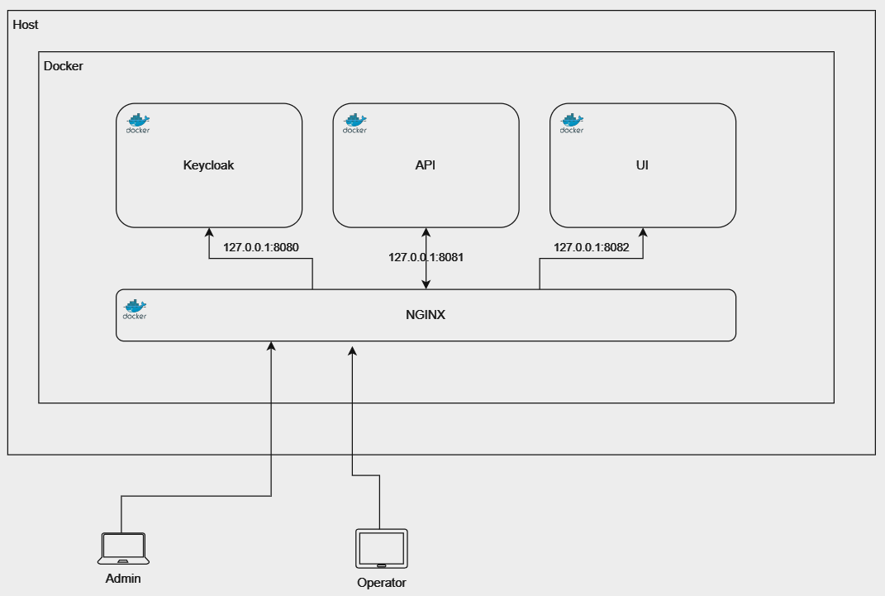

# Architecture Overview

Below diagram shows the applications target architecture when deployed to a docker host.

The application consists of a Frontend and Backend, "Keycloak" as an Identity Provider and an "NGINX Proxy Manager" which serves as a reverse proxy.

All application services are included in one single [docker-compose.yml](../build/result/docker/docker-compose.yml). The file includes definitions for the Frontend ("ui"), Backend ("api"), Reverse Proxy ("nginx") and Identity Provider ("keycloak").

Users connect to the NGINX reverse proxy container, which passes requests to their services destination container. Containers internally communicate via each others external URL.

### Reverse Proxy
"NGINX Proxy Manager" serves as a reverse proxy and allows easy (re-)configuration of application URLs.
The service also includes a certificate manager, which allows convenient SSL configuration of all endpoints using "Let's encrypt" and built-in ceritifcate renewal.

### Authentication
Authentication is realized via "Keycloak". Users can authenticate through username and password or through a client certificate. NGINX is configured to accept client certificates and forward them as base64 via a dedicated header to Keycloak.

Client certificate authentication is especially useful for operator tablets, since not all users can be expected to register, the administrator cannot be expected to support many users. On top of that, this prevents users from connecting to the app from their home PCs. Using a single "machine" user for the tablet also avoids GDPR issues.

### Backend
The backend consists of a .Net 8 API and a file based sqlite database.

### Frontend
The frontend is a React based single-page-application.