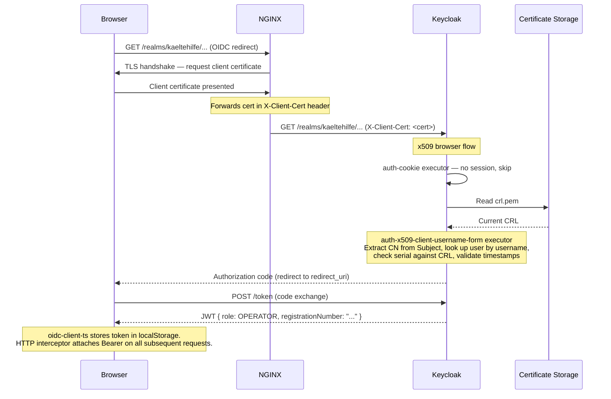
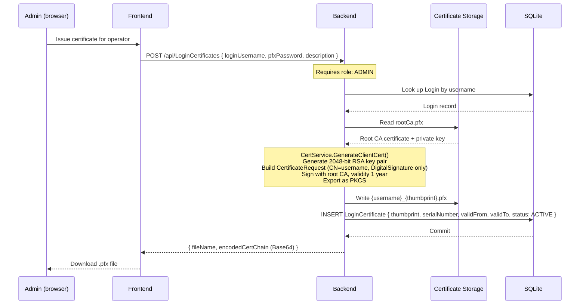
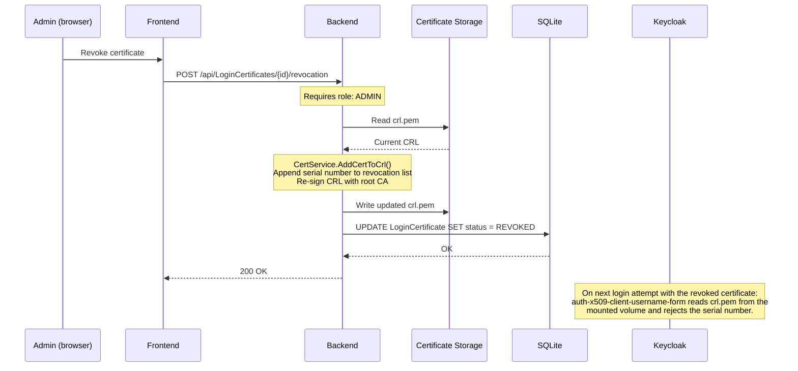
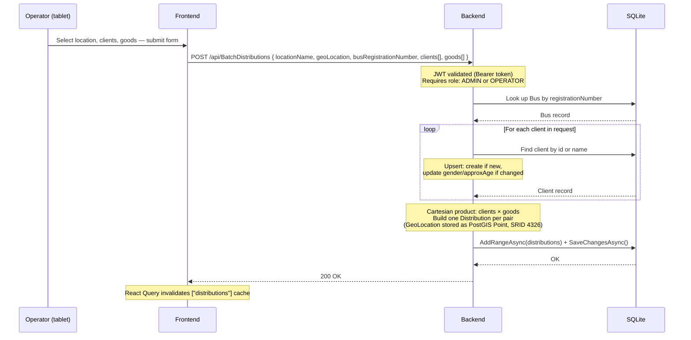
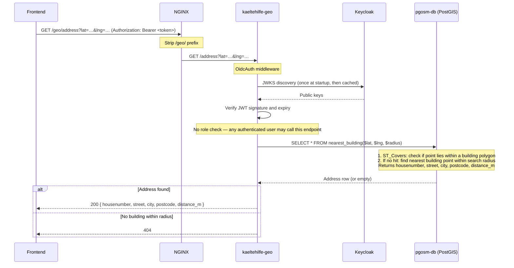

# Introduction and Goals {#section-introduction-and-goals}

Kaeltehilfe is a tool for planning and documentation of goods distribution for frost protection in winter to people in need.

The tool is used by two user groups:
1) Admins
- Plan shifts and assign volunteers ("Operators")
- Manage goods
- Analyze distributions and client locations

2) Operators
- Work in shifts to distribute goods
- Record distributions

## Requirements Overview {#_requirements_overview}

- Admins can manage volunteers and plan shifts
- Admins can view and analyze distributions
- Operators can record distributions

## Quality Goals {#_quality_goals}

| Quality Goal | Scenario |
| ------------ | -------- |
| Reliability | The application must operate with minimum support overhead |
| Safety | "" |
| Performance Efficiency | Operational costs must be as little as possible |
| Interaction Capability | The application must be used and administrated by many different users without training. Users may have little to no technical affinity |

## Stakeholders {#_stakeholders}

| Role | Name | Contact |
| ---- | ---- | ------- |
| Architect and Maintainer | Luka Weis | LukaT.Weis@gmail.com |

# Architecture Constraints {#section-architecture-constraints}

The application serves no finanical interests and must generate no (or as little as possible) costs for development and operation. Avoiding costs should always be the top priority when making architectural decisions. Open source must always be preferred over alternatives.

# Context and Scope {#section-context-and-scope}

The application is self contained with no external dependencies. An external identity provider can be connected, if required.

The following diagram shows both, business and technical contexts.

# Solution Strategy {#section-solution-strategy}

| Quality Goal | Architectual Approach | Description |
| ------------------- | -------------- | ----------- |
| Performance Efficiency | Microservices | The overall architecture follows a microservice approach, which allows us to granually scale distinct services for optimum resource utilization |
| Interaction Capability | Containers | The application is provided through on full package fully configured through docker compose, which provides all services and initializations required to run the application. This allows customer admins to get the app up and running quickly |
| Cost Efficiency | OpenStreetMap | In order to avoid subscription based geo services, we use OpenStreetMap for map views. To resolve addresses from geo data, we use OSM2PG to import publicly available OSM exports to a self hosted PostGIS database with our own address lookup service |
| Security | Keycloak | The application uses Keycloak as identity provider through OpenIdConnect. Both, service and protocol, are widely used and implement security best practices. Keycloak can also be extended by upstream identity providers to integrate in existing auth infrastructure |
| Interaction Capability and Security | X509 Authentication for Operators | Volunteering operators use a tablet device to record distributions. Password logins are not practical, since the password would have to be shared with a large number of users, who would have access to sensitive data. Rotating passwords frequently would generate too much administrative overhead. Therefore the operator tablets are authenticated through X509 client certificates, which can be issued and revoked by admin users |
| Cost Efficiency | SQLite for Application Data | The application uses SQLite with SpatiaLite as its database. This eliminates the need for a separate database server for application data, reducing both operational complexity and cost. The only PostgreSQL instance in the stack is the self-hosted pgosm-db, which is exclusively used by the geo service. |
| Maintainability | Vertical Slice Architecture | Backend features are organized as vertical slices — one folder per domain concept (Busses, Clients, Distributions, Goods, Shifts, Volunteers, Logins, LoginCertificates). Each slice owns its controller and DTOs. Cross-feature coupling is intentionally avoided. |
| Deployment Flexibility | Runtime Configuration Injection | All environment-specific values (API URLs, Keycloak authority, domain names, secrets) are injected at container startup via environment variables. Nothing is baked into Docker images at build time, which allows a single image to be deployed across local development and production without rebuilding. |

# Building Block View {#section-building-block-view}

## Whitebox Overall System {#_whitebox_overall_system}

The following diagram shows the systems Building Blocks and their integration. The two external systems "Certificate Storage" and "Keycloak" are included in the view, since they are deeply required for the application to run and their configuration is part of the distributed package.

| Building Block | Explanation | Important interfaces |
| -------------- | ----------- | -------------------- |
| kaeltehilfe-frontend | Single frontend for both admins and operators. | <li>HTTPS inbound for browser</li><li>HTTPS outbound to kaeltehilfe-backend and kaeltehilfe-geo (REST)</li><li>HTTPS outbound to Keycloak (OIDC auth flow, login, token, client certificate)</li> |
| kaeltehilfe-backend | .NET API for core application | <li>HTTPS inbound from frontend (REST)</li><li>HTTPS outbound to Keycloak for JWT validation</li><li>HTTPS outbound to Keycloak admin API for user operations</li><li>Byte Stream outbound to Certificate Storage (File system) to read signer certificate, write CRL and store client certificates</li><li>DB outbound connection to SQLite through EF Core with NetTopologySuite and SpatiaLite (Byte Stream)</li> |
| kaeltehilfe-geo | Golang API for address lookup | <li>HTTPS inbound from frontend (REST)</li><li>DB outbound connection to pgosm-db through pgx</li><li>HTTPS outbound to Keycloak for JWT Bearer verification (JWKS discovery)</li> |
| pgosm-init | Initializes the pgosm-db with OSM data | DB outbound connection to pgosm-db |
| pgosm-db | GIS database for kaeltehilfe-geo | Inbound postgres listener for kaeltehilfe-geo and pgosm-init |
| certs-init | Initializes signer certificate and prepares files for kaeltehilfe-backend and Keycloak | Byte Stream outbound to Certificate Storage |
| keycloak-init | Prepares realm in Keycloak for kaeltehilfe | HTTPS outbound connection to Keycloak |
| Keycloak | Auth provider for application with X509 client certificate auth flow | <li>HTTPS inbound interface for auth flows</li><li>HTTPS inbound admin API for kaeltehilfe-backend</li><li>Byte Stream inbound from Certificate Storage (CRL for certificate revocation)</li> |
| Certificate Storage | File system volume shared between kaeltehilfe-backend and Keycloak | <li>Byte Stream inbound from certs-init (signer certificate)</li><li>Byte Stream inbound from kaeltehilfe-backend (client certificates, CRL)</li><li>Byte Stream outbound to Keycloak (CRL) and kaeltehilfe-backend (signer certificate)</li> |

NGINX is not a building block but is part of the shipped package and carries two architecturally relevant responsibilities: forwarding the client certificate in the `X-Client-Cert` header (required for the X.509 auth flow) and stripping the `/geo/` path prefix before forwarding to kaeltehilfe-geo. Both are documented in the Deployment View.

## Level 2 {#_level_2}

### White Box *kaeltehilfe-frontend* {#_white_box_kaeltehilfe-frontend}

The frontend is a React 18 based single page application on Vite. The entry point is `main.tsx`, which loads the runtime configuration from `/config.json`, initializes the Axios HTTP client with authentication interceptors, creates the OIDC UserManager, and mounts the provider tree (AuthProvider → QueryClientProvider → ModalsProvider → Notifications) with the React Router.

The application shell utilizes an auth component which is integrated with Keycloak, and provides feature modules grouped into two main entry points: "/" for operator users and "/admin" for admin users. Role-based route guards enforce access at the routing level. A common module provides shared UI components, data hooks (TanStack React Query with a CRUD hook factory), an HTTP client with interceptors for authentication and error handling, and general utilities.

#### Used Libraries
| Name | Description |
| ---- | ----------- |
| vitest | Test runner |
| mantine v7 | Component library for UI |
| mantine-react-table | Table component built on Mantine v7 |
| axios | HTTP client extended with interceptors for authentication and error handling |
| oidc-client-ts, react-oidc-context | OIDC client and React context for auth flow, auto sign-in and token refresh |
| @tanstack/react-query | Data fetching and server-state management (CRUD hook factory) |
| leaflet, react-leaflet | Tile-based map library for map views |
| react-leaflet-markercluster | Extension for leaflet for clustering of nearby markers |
| react-router-dom | Client-side routing with role-based route guards |
| react-resizable-panels | Provides panels for split views |

### White Box *\<kaeltehilfe-backend\>* {#_white_box_kaeltehilfe-backend}

The backend is an ASP.NET 8 based web API. The entry point is `Program.cs`, which registers all services via dependency injection and configures the ASP.NET request pipeline. The application code lives under `Application/` and is organized into four top-level folders:

- **Features/** — Vertical slices, one per domain concept (Admin, Busses, Clients, Distributions, Goods, LoginCertificates, Logins, Shifts, Volunteers). Each slice contains a Controller, a Model (DTOs), and — where needed — a dedicated service (e.g. `BusService` for the bus/login coordination workflow).
- **Infrastructure/** — Cross-cutting services: `Auth/` (CertService, KeycloakUserService, KeycloakClaimsTransformer, CrlInitializer), `Database/` (KbContext — EF Core DbContext with NetTopologySuite, migrations, seeder), `File/` (FileService).
- **Models/** — Domain entities: BaseEntity, Bus, Client, Distribution, Good, Login, LoginCertificate, Shift, Volunteer. All inherit from `BaseEntity` which provides `Id`, `AddOn`, `ChangeOn`, and soft-delete via `IsDeleted`.
- **Shared/** — Reusable cross-feature utilities: `ModelStateValidationFilter`, `InvalidModelStateExceptionHandler`, `SqliteUniqueExceptionHandler`.

Entity Framework is not wrapped into a repository or abstracted away through interfaces, since Entity Framework already is a repository and offers enough flexibility to switch to other database systems.

The ASP.NET middleware pipeline configured in `Program.cs` runs in the following order:

1. Response compression (Gzip)
2. HTTPS redirection
3. CORS
4. Authentication (JWT Bearer / Keycloak)
5. Authorization
6. `InvalidModelStateExceptionHandler` (returns consistent validation error responses)
7. `SqliteUniqueExceptionHandler` (maps UNIQUE constraint violations to 409 Conflict)
8. Controller routing
9. Database migrations, seeding, login initialization, CRL initialization (startup hooks)

#### Used Libraries
| Name | Description |
| ---- | ----------- |
| Entity Framework Core | ORM for SQLite data access |
| NetTopologySuite | .NET geometry types for spatial data (used with SpatiaLite) |
| FluentValidation | Request model validation |
| AutoMapper | DTO mapping between domain models and API contracts |

### White Box *\<kaeltehilfe-geo>* {#_white_box_kaeltehilfe-geo}

The geo service provides address resolution through geo locations. It compiles to the package "api" through `cmd/api/main`. The main package instantiates the database connection pool and injects it into the webserver. It also configures the request pipeline with CORS, authentication through Keycloak and a method guard.

#### Used Libraries
| Name | Description |
| ---- | ----------- |
| standard | The standard library provides most of the functionality, including the web server (net/http ServeMux). |
| github.com/jackc/pgx/v5 | PostGIS query and connection pooling. |
| github.com/coreos/go-oidc/v3 | JWT Bearer verification via Keycloak JWKS discovery. |

# Runtime View {#section-runtime-view}

## Operator Authentication (X.509) {#_operator_authentication}

Operators authenticate using a client certificate installed on the tablet device. A custom Keycloak browser flow (`x509`) runs three executors in sequence: session cookie check, certificate validation, and a username/password fallback subflow. For operators, authentication succeeds at the certificate step.

```mermaid
sequenceDiagram
    participant Browser
    participant NGINX
    participant Keycloak
    participant CertStorage as Certificate Storage

    Browser->>NGINX: GET /realms/kaeltehilfe/... (OIDC redirect)
    NGINX->>Browser: TLS handshake — request client certificate
    Browser->>NGINX: Client certificate presented
    Note over NGINX: Forwards cert in X-Client-Cert header
    NGINX->>Keycloak: GET /realms/kaeltehilfe/... (X-Client-Cert: <cert>)

    Note over Keycloak: x509 browser flow
    Keycloak->>Keycloak: auth-cookie executor — no session, skip
    Keycloak->>CertStorage: Read crl.pem
    CertStorage-->>Keycloak: Current CRL
    Note over Keycloak: auth-x509-client-username-form executor<br/>Extract CN from Subject, look up user by username,<br/>check serial against CRL, validate timestamps
    Keycloak-->>Browser: Authorization code (redirect to redirect_uri)

    Browser->>Keycloak: POST /token (code exchange)
    Keycloak-->>Browser: JWT { role: OPERATOR, registrationNumber: "..." }
    Note over Browser: oidc-client-ts stores token in localStorage.<br/>HTTP interceptor attaches Bearer on all subsequent requests.
```

The JWT includes the `registrationNumber` custom claim — mapped from a Keycloak user attribute — which ties the token to a specific bus and is used by the backend to associate distributions.

## Admin Login (Password Fallback) {#_admin_login}

Admins use the same Keycloak browser flow. Because the admin browser has no client certificate installed, the `auth-x509-client-username-form` executor finds no certificate and the flow continues to the `x509 forms` subflow, which presents a standard username/password form. The resulting JWT contains `role: ADMIN` and no `registrationNumber` claim.

After the token exchange, the frontend's `useProfile` hook extracts the role from `resource_access.users.roles` and the `AuthRoute` guard routes the session to `/admin`.

## Client Certificate Issuance {#_certificate_issuance}

An admin issues a certificate for a new operator tablet. The backend signs the certificate with the root CA private key and persists the result to both the Certificate Storage volume and SQLite. Keycloak trusts all certificates signed by the root CA, so the new certificate is immediately usable for authentication.

```mermaid
sequenceDiagram
    participant Admin as Admin (browser)
    participant Frontend
    participant Backend
    participant CertStorage as Certificate Storage
    participant DB as SQLite

    Admin->>Frontend: Issue certificate for operator
    Frontend->>Backend: POST /api/LoginCertificates { loginUsername, pfxPassword, description }
    Note over Backend: Requires role: ADMIN

    Backend->>DB: Look up Login by username
    DB-->>Backend: Login record
    Backend->>CertStorage: Read rootCa.pfx
    CertStorage-->>Backend: Root CA certificate + private key

    Note over Backend: CertService.GenerateClientCert()<br/>Generate 2048-bit RSA key pair<br/>Build CertificateRequest (CN=username, DigitalSignature only)<br/>Sign with root CA, validity 1 year<br/>Export as PKCS#12 chain (client cert + root cert)

    Backend->>CertStorage: Write {username}_{thumbprint}.pfx
    Backend->>DB: INSERT LoginCertificate { thumbprint, serialNumber, validFrom, validTo, status: ACTIVE }
    DB-->>Backend: Commit
    Backend-->>Frontend: { fileName, encodedCertChain (Base64) }
    Frontend-->>Admin: Download .pfx file
```

The file write and the database insert are wrapped in a transaction. If either step fails, the PFX file is deleted and the transaction is rolled back.

## Certificate Revocation {#_certificate_revocation}

When an operator tablet is lost or decommissioned, an admin revokes its certificate. The backend updates the Certificate Revocation List on the shared volume. Keycloak reads this file on every authentication attempt, so revocation takes effect immediately without a service restart.

```mermaid
sequenceDiagram
    participant Admin as Admin (browser)
    participant Frontend
    participant Backend
    participant CertStorage as Certificate Storage
    participant DB as SQLite
    participant Keycloak

    Admin->>Frontend: Revoke certificate
    Frontend->>Backend: POST /api/LoginCertificates/{id}/revocation
    Note over Backend: Requires role: ADMIN

    Backend->>CertStorage: Read crl.pem
    CertStorage-->>Backend: Current CRL

    Note over Backend: CertService.AddCertToCrl()<br/>Append serial number to revocation list<br/>Re-sign CRL with root CA

    Backend->>CertStorage: Write updated crl.pem
    Backend->>DB: UPDATE LoginCertificate SET status = REVOKED
    DB-->>Backend: OK
    Backend-->>Frontend: 200 OK

    Note over Keycloak: On next login attempt with the revoked certificate:<br/>auth-x509-client-username-form reads crl.pem from the<br/>mounted volume and rejects the serial number.
```

## Distribution Recording {#_distribution_recording}

The core operator workflow. Operator logins represent buses (Schichtträger), not individual persons — the `registrationNumber` in the JWT identifies the bus, not the user. An operator selects a location, one or more clients, and the goods distributed to each. The backend creates one `Distribution` record per client–good pair.

```mermaid
sequenceDiagram
    participant Operator as Operator (tablet)
    participant Frontend
    participant Backend
    participant DB as SQLite

    Operator->>Frontend: Select location, clients, goods — submit form
    Frontend->>Backend: POST /api/BatchDistributions { locationName, geoLocation, busRegistrationNumber, clients[], goods[] }
    Note over Backend: JWT validated (Bearer token)<br/>Requires role: ADMIN or OPERATOR

    Backend->>DB: Look up Bus by registrationNumber
    DB-->>Backend: Bus record

    loop For each client in request
        Backend->>DB: Find client by id or name
        Note over Backend: Upsert: create if new,<br/>update gender/approxAge if changed
        DB-->>Backend: Client record
    end

    Note over Backend: Cartesian product: clients × goods<br/>Build one Distribution per pair<br/>(GeoLocation stored as PostGIS Point, SRID 4326)

    Backend->>DB: AddRangeAsync(distributions) + SaveChangesAsync()
    DB-->>Backend: OK
    Backend-->>Frontend: 200 OK
    Note over Frontend: React Query invalidates ["distributions"] cache
```

## Address Lookup {#_address_lookup}

When an operator pins a location on the map, the frontend resolves the coordinates to a human-readable address via the geo service. In production, NGINX strips the `/geo/` path prefix before forwarding; the service itself only sees `/address`.

```mermaid
sequenceDiagram
    participant Frontend
    participant NGINX
    participant Geo as kaeltehilfe-geo
    participant Keycloak
    participant pgosm as pgosm-db (PostGIS)

    Frontend->>NGINX: GET /geo/address?lat=…&lng=… (Authorization: Bearer <token>)
    Note over NGINX: Strip /geo/ prefix
    NGINX->>Geo: GET /address?lat=…&lng=…

    Note over Geo: OidcAuth middleware
    Geo->>Keycloak: JWKS discovery (once at startup, then cached)
    Keycloak-->>Geo: Public keys
    Geo->>Geo: Verify JWT signature and expiry
    Note over Geo: No role check — any authenticated user may call this endpoint

    Geo->>pgosm: SELECT * FROM nearest_building($lat, $lng, $radius)
    Note over pgosm: 1. ST_Covers: check if point lies within a building polygon<br/>2. If no hit: find nearest building point within search radius<br/>Returns housenumber, street, city, postcode, distance_m
    pgosm-->>Geo: Address row (or empty)

    alt Address found
        Geo-->>Frontend: 200 { housenumber, street, city, postcode, distance_m }
    else No building within radius
        Geo-->>Frontend: 404
    end
```

# Deployment View {#section-deployment-view}

## Infrastructure Level 1 {#_infrastructure_level_1}

***\<Overview Diagram\>***

Motivation

:   *\<explanation in text form\>*

Quality and/or Performance Features

:   *\<explanation in text form\>*

Mapping of Building Blocks to Infrastructure

:   *\<description of the mapping\>*

## Infrastructure Level 2 {#_infrastructure_level_2}

### *\<Infrastructure Element 1\>* {#_infrastructure_element_1}

*\<diagram + explanation\>*

### *\<Infrastructure Element 2\>* {#_infrastructure_element_2}

*\<diagram + explanation\>*

...​

### *\<Infrastructure Element n\>* {#_infrastructure_element_n}

*\<diagram + explanation\>*

# Cross-cutting Concepts {#section-concepts}

## *\<Concept 1\>* {#_concept_1}

*\<explanation\>*

## *\<Concept 2\>* {#_concept_2}

*\<explanation\>*

...​

## *\<Concept n\>* {#_concept_n}

*\<explanation\>*

# Architecture Decisions {#section-design-decisions}

# Quality Requirements {#section-quality-scenarios}

## Quality Requirements Overview {#_quality_requirements_overview}

## Quality Scenarios {#_quality_scenarios}

# Risks and Technical Debts {#section-technical-risks}

# Glossary {#section-glossary}

+----------------------+-----------------------------------------------+
| Term                 | Definition                                    |
+======================+===============================================+
| *\<Term-1\>*         | *\<definition-1\>*                            |
+----------------------+-----------------------------------------------+
| *\<Term-2\>*         | *\<definition-2\>*                            |
+----------------------+-----------------------------------------------+
