# Introduction and Goals {#section-introduction-and-goals}

Kaeltehilfe is a tool for planning and documentation of goods distribution for frost protection in winter to people in need.

The tool is used by two user groups:
1) Admins
- Plan shifts and assign volunteers ("Operators")
- Manage goods
- Analyze distributions and client locations

2) Operators
- Work in shifts to distribute goods
- Record distributions

## Requirements Overview {#_requirements_overview}

- Admins can manage volunteers and plan shifts
- Admins can view and analyze distributions
- Operators can record distributions

## Quality Goals {#_quality_goals}

| Quality Goal | Scenario |
| ------------ | -------- |
| Reliability | The application must operate with minimum support overhead |
| Safety | "" |
| Performance Efficiency | Operational costs must be as little as possible |
| Interaction Capability | The application must be used and administrated by many different users without training. Users may have little to no technical affinity |

## Stakeholders {#_stakeholders}

| Role | Name | Contact |
| ---- | ---- | ------- |
| Architect and Maintainer | Luka Weis | LukaT.Weis@gmail.com |

# Architecture Constraints {#section-architecture-constraints}

The application serves no finanical interests and must generate no (or as little as possible) costs for development and operation. Avoiding costs should always be the top priority when making architectural decisions. Open source must always be preferred over alternatives.

# Context and Scope {#section-context-and-scope}

The application is self contained with no external dependencies. An external identity provider can be connected, if required.

The following diagram shows both, business and technical contexts.

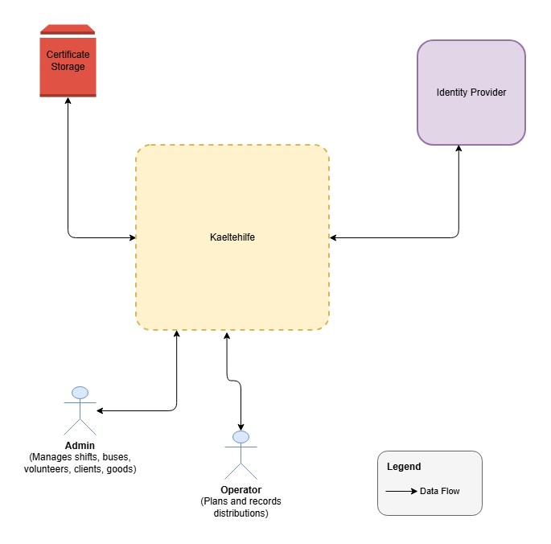

# Solution Strategy {#section-solution-strategy}

| Quality Goal | Architectual Approach | Description |
| ------------------- | -------------- | ----------- |
| Performance Efficiency | Microservices | The overall architecture follows a microservice approach, which allows us to granually scale distinct services for optimum resource utilization |
| Interaction Capability | Containers | The application is provided through on full package fully configured through docker compose, which provides all services and initializations required to run the application. This allows customer admins to get the app up and running quickly |
| Cost Efficiency | OpenStreetMap | In order to avoid subscription based geo services, we use OpenStreetMap for map views. To resolve addresses from geo data, we use OSM2PG to import publicly available OSM exports to a self hosted PostGIS database with our own address lookup service |
| Security | Keycloak | The application uses Keycloak as identity provider through OpenIdConnect. Both, service and protocol, are widely used and implement security best practices. Keycloak can also be extended by upstream identity providers to integrate in existing auth infrastructure |
| Interaction Capability and Security | X509 Authentication for Operators | Volunteering operators use a tablet device to record distributions. Password logins are not practical, since the password would have to be shared with a large number of users, who would have access to sensitive data. Rotating passwords frequently would generate too much administrative overhead. Therefore the operator tablets are authenticated through X509 client certificates, which can be issued and revoked by admin users |
| Cost Efficiency | SQLite for Application Data | The application uses SQLite with SpatiaLite as its database. This eliminates the need for a separate database server for application data, reducing both operational complexity and cost. The only PostgreSQL instance in the stack is the self-hosted pgosm-db, which is exclusively used by the geo service. |
| Maintainability | Vertical Slice Architecture | Backend features are organized as vertical slices — one folder per domain concept (Busses, Clients, Distributions, Goods, Shifts, Volunteers, Logins, LoginCertificates). Each slice owns its controller and DTOs. Cross-feature coupling is intentionally avoided. |
| Deployment Flexibility | Runtime Configuration Injection | All environment-specific values (API URLs, Keycloak authority, domain names, secrets) are injected at container startup via environment variables. Nothing is baked into Docker images at build time, which allows a single image to be deployed across local development and production without rebuilding. |

# Building Block View {#section-building-block-view}

## Whitebox Overall System {#_whitebox_overall_system}

The following diagram shows the systems Building Blocks and their integration. The two external systems "Certificate Storage" and "Keycloak" are included in the view, since they are deeply required for the application to run and their configuration is part of the distributed package.

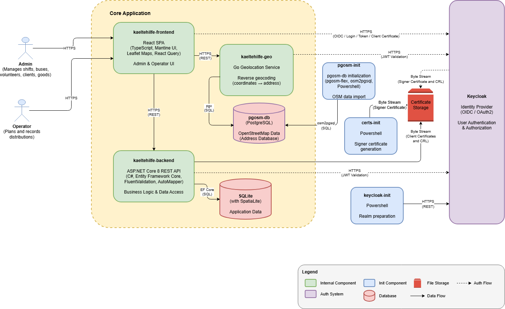

| Building Block | Explanation | Important interfaces |
| -------------- | ----------- | -------------------- |
| kaeltehilfe-frontend | Single frontend for both admins and operators. | <li>HTTPS inbound for browser</li><li>HTTPS outbound to kaeltehilfe-backend and kaeltehilfe-geo (REST)</li><li>HTTPS outbound to Keycloak (OIDC auth flow, login, token, client certificate)</li> |
| kaeltehilfe-backend | .NET API for core application | <li>HTTPS inbound from frontend (REST)</li><li>HTTPS outbound to Keycloak for JWT validation</li><li>HTTPS outbound to Keycloak admin API for user operations</li><li>Byte Stream outbound to Certificate Storage (File system) to read signer certificate, write CRL and store client certificates</li><li>DB outbound connection to SQLite through EF Core with NetTopologySuite and SpatiaLite (Byte Stream)</li> |
| kaeltehilfe-geo | Golang API for address lookup | <li>HTTPS inbound from frontend (REST)</li><li>DB outbound connection to pgosm-db through pgx</li><li>HTTPS outbound to Keycloak for JWT Bearer verification (JWKS discovery)</li> |
| pgosm-init | Initializes the pgosm-db with OSM data | DB outbound connection to pgosm-db |
| pgosm-db | GIS database for kaeltehilfe-geo | Inbound postgres listener for kaeltehilfe-geo and pgosm-init |
| certs-init | Initializes signer certificate and prepares files for kaeltehilfe-backend and Keycloak | Byte Stream outbound to Certificate Storage |
| keycloak-init | Prepares realm in Keycloak for kaeltehilfe | HTTPS outbound connection to Keycloak |
| Keycloak | Auth provider for application with X509 client certificate auth flow | <li>HTTPS inbound interface for auth flows</li><li>HTTPS inbound admin API for kaeltehilfe-backend</li><li>Byte Stream inbound from Certificate Storage (CRL for certificate revocation)</li> |
| Certificate Storage | File system volume shared between kaeltehilfe-backend and Keycloak | <li>Byte Stream inbound from certs-init (signer certificate)</li><li>Byte Stream inbound from kaeltehilfe-backend (client certificates, CRL)</li><li>Byte Stream outbound to Keycloak (CRL) and kaeltehilfe-backend (signer certificate)</li> |

NGINX is not a building block but is part of the shipped package and carries two architecturally relevant responsibilities: forwarding the client certificate in the `X-Client-Cert` header (required for the X.509 auth flow) and stripping the `/geo/` path prefix before forwarding to kaeltehilfe-geo. Both are documented in the Deployment View.

## Level 2 {#_level_2}

### White Box *kaeltehilfe-frontend* {#_white_box_kaeltehilfe-frontend}

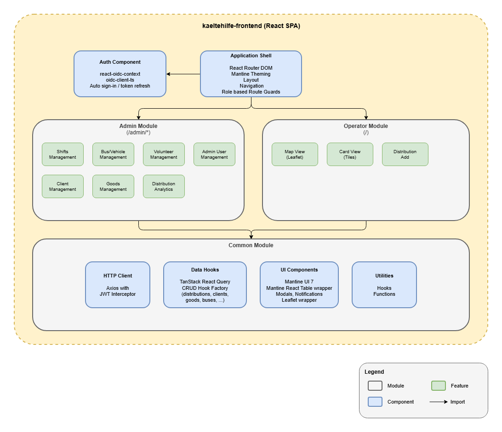

The frontend is a React 18 based single page application on Vite. The entry point is `main.tsx`, which loads the runtime configuration from `/config.json`, initializes the Axios HTTP client with authentication interceptors, creates the OIDC UserManager, and mounts the provider tree (AuthProvider → QueryClientProvider → ModalsProvider → Notifications) with the React Router.

The application shell utilizes an auth component which is integrated with Keycloak, and provides feature modules grouped into two main entry points: "/" for operator users and "/admin" for admin users. Role-based route guards enforce access at the routing level. A common module provides shared UI components, data hooks (TanStack React Query with a CRUD hook factory), an HTTP client with interceptors for authentication and error handling, and general utilities.

#### Used Libraries
| Name | Description |
| ---- | ----------- |
| vitest | Test runner |
| mantine v7 | Component library for UI |
| mantine-react-table | Table component built on Mantine v7 |
| axios | HTTP client extended with interceptors for authentication and error handling |
| oidc-client-ts, react-oidc-context | OIDC client and React context for auth flow, auto sign-in and token refresh |
| @tanstack/react-query | Data fetching and server-state management (CRUD hook factory) |
| leaflet, react-leaflet | Tile-based map library for map views |
| react-leaflet-markercluster | Extension for leaflet for clustering of nearby markers |
| react-router-dom | Client-side routing with role-based route guards |
| react-resizable-panels | Provides panels for split views |

### White Box *\<kaeltehilfe-backend\>* {#_white_box_kaeltehilfe-backend}

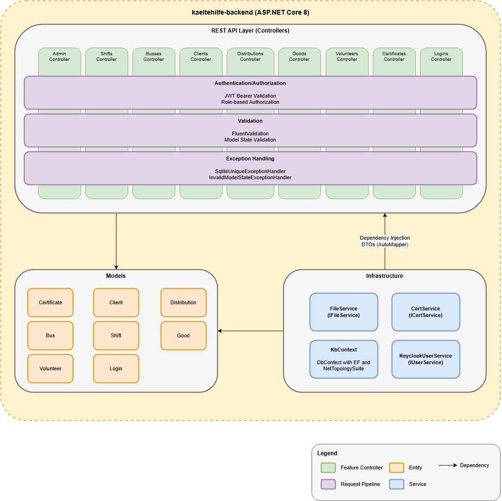

The backend is an ASP.NET 8 based web API. The entry point is `Program.cs`, which registers all services via dependency injection and configures the ASP.NET request pipeline. The application code lives under `Application/` and is organized into four top-level folders:

- **Features/** — Vertical slices, one per domain concept (Admin, Busses, Clients, Distributions, Goods, LoginCertificates, Logins, Shifts, Volunteers). Each slice contains a Controller, a Model (DTOs), and — where needed — a dedicated service (e.g. `BusService` for the bus/login coordination workflow).
- **Infrastructure/** — Cross-cutting services: `Auth/` (CertService, KeycloakUserService, KeycloakClaimsTransformer, CrlInitializer), `Database/` (KbContext — EF Core DbContext with NetTopologySuite, migrations, seeder), `File/` (FileService).
- **Models/** — Domain entities: BaseEntity, Bus, Client, Distribution, Good, Login, LoginCertificate, Shift, Volunteer. All inherit from `BaseEntity` which provides `Id`, `AddOn`, `ChangeOn`, and soft-delete via `IsDeleted`.
- **Shared/** — Reusable cross-feature utilities: `ModelStateValidationFilter`, `InvalidModelStateExceptionHandler`, `SqliteUniqueExceptionHandler`.

Entity Framework is not wrapped into a repository or abstracted away through interfaces, since Entity Framework already is a repository and offers enough flexibility to switch to other database systems.

The ASP.NET middleware pipeline configured in `Program.cs` runs in the following order:

1. Response compression (Gzip)
2. HTTPS redirection
3. CORS
4. Authentication (JWT Bearer / Keycloak)
5. Authorization
6. `InvalidModelStateExceptionHandler` (returns consistent validation error responses)
7. `SqliteUniqueExceptionHandler` (maps UNIQUE constraint violations to 409 Conflict)
8. Controller routing
9. Database migrations, seeding, login initialization, CRL initialization (startup hooks)

#### Used Libraries
| Name | Description |
| ---- | ----------- |
| Entity Framework Core | ORM for SQLite data access |
| NetTopologySuite | .NET geometry types for spatial data (used with SpatiaLite) |
| FluentValidation | Request model validation |
| AutoMapper | DTO mapping between domain models and API contracts |

### White Box *\<kaeltehilfe-geo>* {#_white_box_kaeltehilfe-geo}

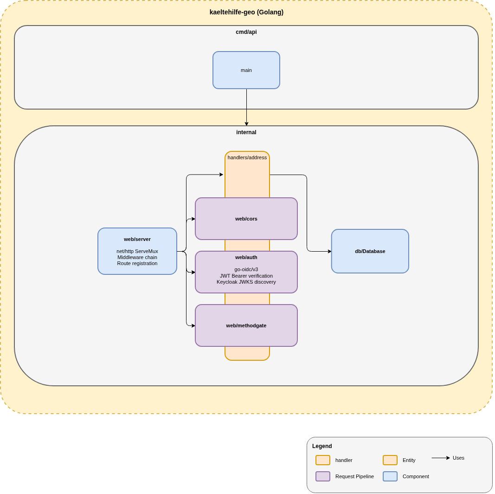

The geo service provides address resolution through geo locations. It compiles to the package "api" through `cmd/api/main`. The main package instantiates the database connection pool and injects it into the webserver. It also configures the request pipeline with CORS, authentication through Keycloak and a method guard.

#### Used Libraries
| Name | Description |
| ---- | ----------- |
| standard | The standard library provides most of the functionality, including the web server (net/http ServeMux). |
| github.com/jackc/pgx/v5 | PostGIS query and connection pooling. |
| github.com/coreos/go-oidc/v3 | JWT Bearer verification via Keycloak JWKS discovery. |

# Runtime View {#section-runtime-view}

## Operator Authentication (X.509) {#_operator_authentication}

Operators authenticate using a client certificate installed on the tablet device. A custom Keycloak browser flow (`x509`) runs three executors in sequence: session cookie check, certificate validation, and a username/password fallback subflow. For operators, authentication succeeds at the certificate step.

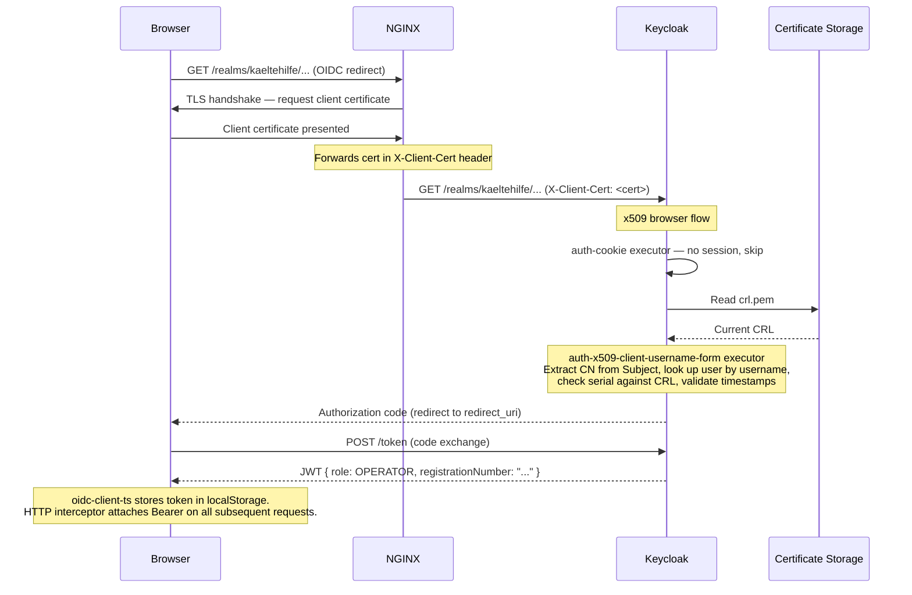
```mermaid
sequenceDiagram
    participant Browser
    participant NGINX
    participant Keycloak
    participant CertStorage as Certificate Storage

    Browser->>NGINX: GET /realms/kaeltehilfe/... (OIDC redirect)
    NGINX->>Browser: TLS handshake — request client certificate
    Browser->>NGINX: Client certificate presented
    Note over NGINX: Forwards cert in X-Client-Cert header
    NGINX->>Keycloak: GET /realms/kaeltehilfe/... (X-Client-Cert: <cert>)

    Note over Keycloak: x509 browser flow
    Keycloak->>Keycloak: auth-cookie executor — no session, skip
    Keycloak->>CertStorage: Read crl.pem
    CertStorage-->>Keycloak: Current CRL
    Note over Keycloak: auth-x509-client-username-form executor<br/>Extract CN from Subject, look up user by username,<br/>check serial against CRL, validate timestamps
    Keycloak-->>Browser: Authorization code (redirect to redirect_uri)

    Browser->>Keycloak: POST /token (code exchange)
    Keycloak-->>Browser: JWT { role: OPERATOR, registrationNumber: "..." }
    Note over Browser: oidc-client-ts stores token in localStorage.<br/>HTTP interceptor attaches Bearer on all subsequent requests.
```

The JWT includes the `registrationNumber` custom claim — mapped from a Keycloak user attribute — which ties the token to a specific bus and is used by the backend to associate distributions.

## Admin Login (Password Fallback) {#_admin_login}

Admins use the same Keycloak browser flow. Because the admin browser has no client certificate installed, the `auth-x509-client-username-form` executor finds no certificate and the flow continues to the `x509 forms` subflow, which presents a standard username/password form. The resulting JWT contains `role: ADMIN` and no `registrationNumber` claim.

After the token exchange, the frontend's `useProfile` hook extracts the role from `resource_access.users.roles` and the `AuthRoute` guard routes the session to `/admin`.

## Client Certificate Issuance {#_certificate_issuance}

An admin issues a certificate for a new operator tablet. The backend signs the certificate with the root CA private key and persists the result to both the Certificate Storage volume and SQLite. Keycloak trusts all certificates signed by the root CA, so the new certificate is immediately usable for authentication.

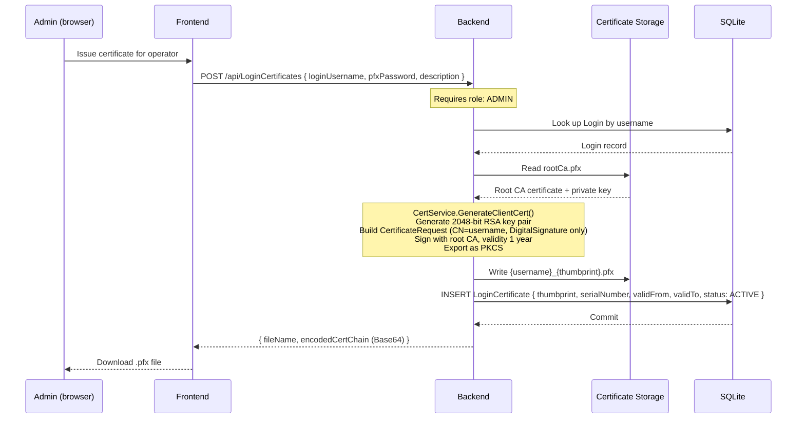
```mermaid
sequenceDiagram
    participant Admin as Admin (browser)
    participant Frontend
    participant Backend
    participant CertStorage as Certificate Storage
    participant DB as SQLite

    Admin->>Frontend: Issue certificate for operator
    Frontend->>Backend: POST /api/LoginCertificates { loginUsername, pfxPassword, description }
    Note over Backend: Requires role: ADMIN

    Backend->>DB: Look up Login by username
    DB-->>Backend: Login record
    Backend->>CertStorage: Read rootCa.pfx
    CertStorage-->>Backend: Root CA certificate + private key

    Note over Backend: CertService.GenerateClientCert()<br/>Generate 2048-bit RSA key pair<br/>Build CertificateRequest (CN=username, DigitalSignature only)<br/>Sign with root CA, validity 1 year<br/>Export as PKCS#12 chain (client cert + root cert)

    Backend->>CertStorage: Write {username}_{thumbprint}.pfx
    Backend->>DB: INSERT LoginCertificate { thumbprint, serialNumber, validFrom, validTo, status: ACTIVE }
    DB-->>Backend: Commit
    Backend-->>Frontend: { fileName, encodedCertChain (Base64) }
    Frontend-->>Admin: Download .pfx file
```

The file write and the database insert are wrapped in a transaction. If either step fails, the PFX file is deleted and the transaction is rolled back.

## Certificate Revocation {#_certificate_revocation}

When an operator tablet is lost or decommissioned, an admin revokes its certificate. The backend updates the Certificate Revocation List on the shared volume. Keycloak reads this file on every authentication attempt, so revocation takes effect immediately without a service restart.

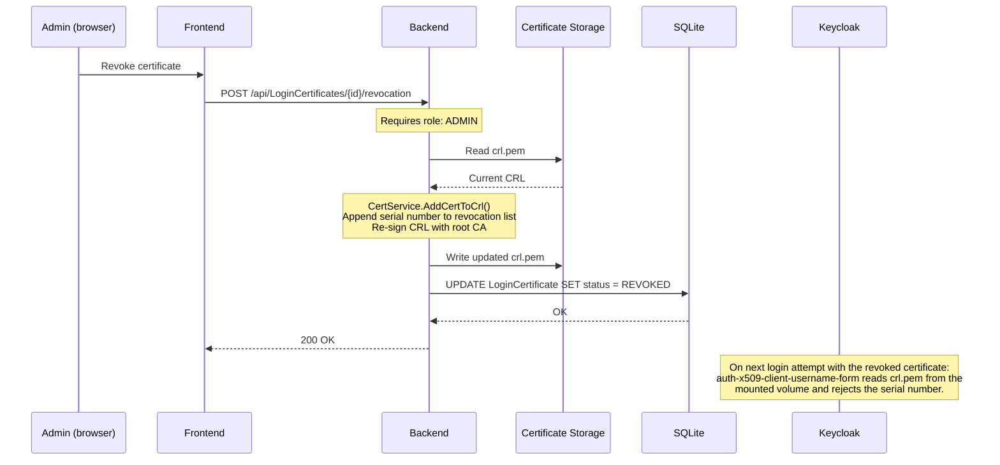
```mermaid
sequenceDiagram
    participant Admin as Admin (browser)
    participant Frontend
    participant Backend
    participant CertStorage as Certificate Storage
    participant DB as SQLite
    participant Keycloak

    Admin->>Frontend: Revoke certificate
    Frontend->>Backend: POST /api/LoginCertificates/{id}/revocation
    Note over Backend: Requires role: ADMIN

    Backend->>CertStorage: Read crl.pem
    CertStorage-->>Backend: Current CRL

    Note over Backend: CertService.AddCertToCrl()<br/>Append serial number to revocation list<br/>Re-sign CRL with root CA

    Backend->>CertStorage: Write updated crl.pem
    Backend->>DB: UPDATE LoginCertificate SET status = REVOKED
    DB-->>Backend: OK
    Backend-->>Frontend: 200 OK

    Note over Keycloak: On next login attempt with the revoked certificate:<br/>auth-x509-client-username-form reads crl.pem from the<br/>mounted volume and rejects the serial number.
```

## Distribution Recording {#_distribution_recording}

The core operator workflow. Operator logins represent buses (Schichtträger), not individual persons — the `registrationNumber` in the JWT identifies the bus, not the user. An operator selects a location, one or more clients, and the goods distributed to each. The backend creates one `Distribution` record per client–good pair.

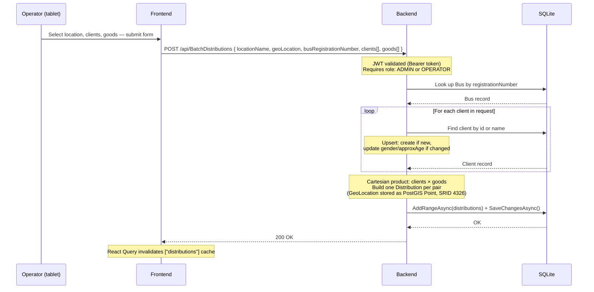
```mermaid
sequenceDiagram
    participant Operator as Operator (tablet)
    participant Frontend
    participant Backend
    participant DB as SQLite

    Operator->>Frontend: Select location, clients, goods — submit form
    Frontend->>Backend: POST /api/BatchDistributions { locationName, geoLocation, busRegistrationNumber, clients[], goods[] }
    Note over Backend: JWT validated (Bearer token)<br/>Requires role: ADMIN or OPERATOR

    Backend->>DB: Look up Bus by registrationNumber
    DB-->>Backend: Bus record

    loop For each client in request
        Backend->>DB: Find client by id or name
        Note over Backend: Upsert: create if new,<br/>update gender/approxAge if changed
        DB-->>Backend: Client record
    end

    Note over Backend: Cartesian product: clients × goods<br/>Build one Distribution per pair<br/>(GeoLocation stored as PostGIS Point, SRID 4326)

    Backend->>DB: AddRangeAsync(distributions) + SaveChangesAsync()
    DB-->>Backend: OK
    Backend-->>Frontend: 200 OK
    Note over Frontend: React Query invalidates ["distributions"] cache
```

## Address Lookup {#_address_lookup}

When an operator pins a location on the map, the frontend resolves the coordinates to a human-readable address via the geo service. In production, NGINX strips the `/geo/` path prefix before forwarding; the service itself only sees `/address`.

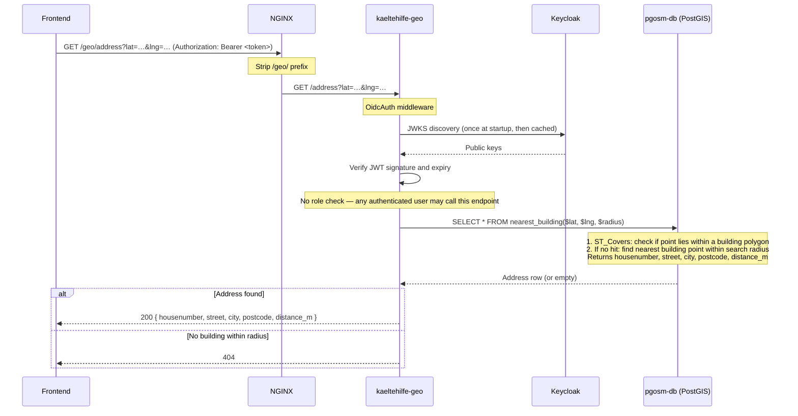
```mermaid
sequenceDiagram
    participant Frontend
    participant NGINX
    participant Geo as kaeltehilfe-geo
    participant Keycloak
    participant pgosm as pgosm-db (PostGIS)

    Frontend->>NGINX: GET /geo/address?lat=…&lng=… (Authorization: Bearer <token>)
    Note over NGINX: Strip /geo/ prefix
    NGINX->>Geo: GET /address?lat=…&lng=…

    Note over Geo: OidcAuth middleware
    Geo->>Keycloak: JWKS discovery (once at startup, then cached)
    Keycloak-->>Geo: Public keys
    Geo->>Geo: Verify JWT signature and expiry
    Note over Geo: No role check — any authenticated user may call this endpoint

    Geo->>pgosm: SELECT * FROM nearest_building($lat, $lng, $radius)
    Note over pgosm: 1. ST_Covers: check if point lies within a building polygon<br/>2. If no hit: find nearest building point within search radius<br/>Returns housenumber, street, city, postcode, distance_m
    pgosm-->>Geo: Address row (or empty)

    alt Address found
        Geo-->>Frontend: 200 { housenumber, street, city, postcode, distance_m }
    else No building within radius
        Geo-->>Frontend: 404
    end
```

# Deployment View {#section-deployment-view}

## Infrastructure Level 1 {#_infrastructure_level_1}

The application runs on a single Ubuntu VPS. NGINX Proxy Manager is the only service with public-facing ports; all other containers bind exclusively to `127.0.0.1` and are reachable only from the host.

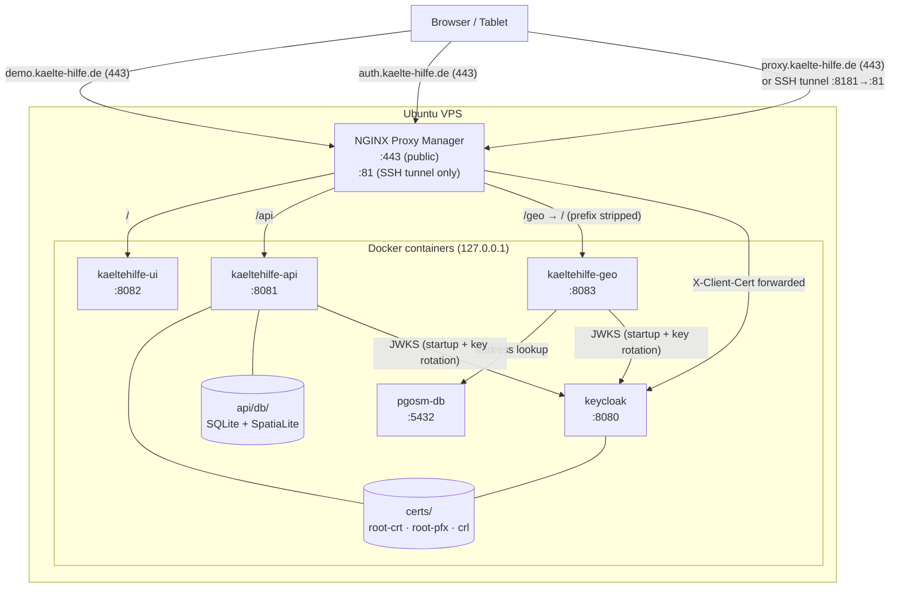
```mermaid
graph TD
    Browser["Browser / Tablet"]

    subgraph VPS["Ubuntu VPS"]
        Proxy["NGINX Proxy Manager\n:443 (public)\n:81 (SSH tunnel only)"]

        subgraph Docker["Docker containers (127.0.0.1)"]
            UI["kaeltehilfe-ui\n:8082"]
            API["kaeltehilfe-api\n:8081"]
            GEO["kaeltehilfe-geo\n:8083"]
            KC["keycloak\n:8080"]
            PGOSM["pgosm-db\n:5432"]

            CertsVol[("certs/\nroot-crt · root-pfx · crl")]
            SQLiteVol[("api/db/\nSQLite + SpatiaLite")]
        end
    end

    Browser -->|"demo.kaelte-hilfe.de (443)"| Proxy
    Browser -->|"auth.kaelte-hilfe.de (443)"| Proxy
    Browser -->|"proxy.kaelte-hilfe.de (443)\nor SSH tunnel :8181→:81"| Proxy

    Proxy -->|"/"| UI
    Proxy -->|"/api"| API
    Proxy -->|"/geo → / (prefix stripped)"| GEO
    Proxy -->|"X-Client-Cert forwarded"| KC

    API --- CertsVol
    KC --- CertsVol
    API --- SQLiteVol
    GEO -->|"address lookup"| PGOSM
    API -->|"JWKS (startup + key rotation)"| KC
    GEO -->|"JWKS (startup + key rotation)"| KC
```

### Building Block to Container Mapping

| Building Block | Container | Host binding |
| -------------- | --------- | ------------ |
| kaeltehilfe-frontend | `ui` | `127.0.0.1:8082` |
| kaeltehilfe-backend | `api` | `127.0.0.1:8081` |
| kaeltehilfe-geo | `geo` | `127.0.0.1:8083` |
| Keycloak | `keycloak` | `127.0.0.1:8080` |
| pgosm-db | `pgosm-db` | `127.0.0.1:5432` |
| NGINX Proxy Manager | `proxy` | `0.0.0.0:80`, `:443`, `:81` |

Init containers (`certs-init`, `keycloak-init`, `pgosm-init`) run once at startup and exit. They are not mapped to permanent host ports.

### Shared Certificate Volume

The `certs/` directory on the host is a shared volume that decouples certificate lifecycle between the backend and Keycloak.

| Host path | Written by | Read by | Content |
| --------- | ---------- | ------- | ------- |
| `certs/root-crt/` | `certs-init` | `keycloak`, `api` | Root CA public certificate — Keycloak uses it as the trust anchor for X.509 client certificate validation |
| `certs/root-pfx/` | `certs-init` | `api` | Root CA private key — used by the backend to sign operator client certificates |
| `certs/crl/` | `api` | `keycloak` | Certificate Revocation List — updated by the backend on revocation; Keycloak reads it on every authentication attempt |

### Network Topology

`proxy` runs with `network_mode: host`, placing it on the host network directly. This allows it to reach all other containers via `127.0.0.1`, which bind to the loopback interface rather than the Docker bridge network. As a result, no service port is reachable from outside the host — all external traffic enters exclusively through NGINX Proxy Manager on ports 80 and 443.

Port 81 (NGINX Proxy Manager admin UI) is not opened in the host firewall and is accessed only via SSH tunnel. See [VPS setup — Firewall](./vps.md#3-firewall) for instructions.

For initial deployment, proxy host configuration, NGINX advanced settings (Keycloak header forwarding, geo path stripping), and update procedures, see [deploy.md](./deploy.md). For VPS provisioning, see [vps.md](./vps.md).

# Cross-cutting Concepts {#section-concepts}

## Authentication and Authorization {#_authentication_authorization}

All three services use Keycloak as the single authority for authentication and authorization. JWT Bearer tokens issued by Keycloak are the common credential — each service validates them independently using JWKS public keys fetched from Keycloak at startup and cached for the lifetime of the process (refreshed only on key rotation).

The role claim requires service-specific handling because Keycloak encodes client roles under `resource_access.<clientId>.roles` rather than as a flat claim:

- **kaeltehilfe-backend**: ASP.NET JWT Bearer middleware validates the token; `KeycloakClaimsTransformer` extracts the nested roles and maps them to standard .NET role claims, enabling `[Authorize(Roles = "ADMIN")]` attributes throughout.
- **kaeltehilfe-geo**: go-oidc middleware validates the token via JWKS. No role check is applied — any authenticated user may call the address lookup endpoint.
- **kaeltehilfe-frontend**: `oidc-client-ts` / `react-oidc-context` manage the OIDC session. An Axios interceptor attaches the Bearer token to every outbound request and triggers `signinRedirect` on 401. The `useProfile` hook extracts the role from `resource_access.users.roles`; `AuthRoute` enforces role-based access at the React Router level.

## Idempotent Initialization {#_idempotent_initialization}

All three init containers (`certs-init`, `keycloak-init`, `pgosm-init`) follow the same pattern: check whether the target resources already exist, and exit cleanly if they do. This makes `docker compose up` safely re-runnable — init containers will not re-generate certificates, re-bootstrap the Keycloak realm, or re-import OSM data if a previous run already completed. The check is the first step in each container's entrypoint; nothing is modified unless the check finds missing resources.

## Soft Delete {#_soft_delete}

All domain entities in the backend inherit from `BaseEntity`, which provides `Id`, `AddOn` (creation timestamp), `ChangeOn` (last modification timestamp), and `IsDeleted` (soft-delete flag). Records are never hard-deleted from the database. This preserves distribution history and audit trails, which are core to the application's purpose.

## Runtime Configuration Injection {#_runtime_configuration}

No environment-specific values are baked into Docker images at build time. All URLs, secrets, and domain names are injected at container startup, which allows a single set of images to be used across local development and production without rebuilding.

Each service has its own injection mechanism:

| Service | Mechanism |
| ------- | --------- |
| kaeltehilfe-frontend | Nginx serves `/config.json` from environment variables at startup; the React app fetches it before mounting |
| kaeltehilfe-backend | `appsettings.json` is mounted as a read-only volume; additional values are passed as environment variables |
| kaeltehilfe-geo | Environment variables only |
| Keycloak, init containers | Environment variables only |

## Logging {#_logging}

All containers use the Docker `json-file` log driver, capped at 50 MB per container. Logs from all services are accessible on the host via `docker compose logs`, optionally filtered by service name or time range (`--since`).

**Correlation IDs:** NGINX generates a unique `X-Correlation-Id` header per request using the built-in `$request_id` variable (16-byte random hex) and forwards it to all upstream services. The backend reads the header in a middleware, adds it to the ASP.NET log scope for the duration of the request, and echoes it in the response. The geo service reads the header in `CorrelationMiddleware`, logs it as a structured field on every request, and echoes it in the response. If no header is present (e.g. in local development without NGINX), the backend falls back to `HttpContext.TraceIdentifier` and the geo service falls back to a nanosecond timestamp.

The correlation ID in the response header allows browser dev tools to match a network request to the corresponding server log lines. For cross-service queries, filtering `docker compose logs` by the correlation ID string is sufficient at the current scale.

# Architecture Decisions {#section-design-decisions}

## ADR-001: X.509 Client Certificate Authentication with Keycloak {#_adr_001}

**Context:** Operator tablets are shared devices used by rotating volunteers. A shared password would expose sensitive distribution data to anyone who ever learned it. Rotating passwords frequently would create unacceptable administrative overhead. Individual TOTP adds UX friction on tablet devices used under time pressure in the field.

**Alternatives considered:** Shared password login; individual TOTP per volunteer; cloud identity providers with certificate support.

**Decision:** Operators authenticate via X.509 client certificates installed on each tablet. Keycloak is bundled in the shipped docker-compose package because it provides the custom `x509` browser flow — certificate validation, CRL checking, and a username/password fallback for admins in a single configurable auth flow. NGINX forwards the client certificate in the `X-Client-Cert` header to Keycloak. Certificates are issued and revoked by admin users through the application itself.

**Consequences:** Keycloak adds memory overhead to the stack. NGINX must be configured to request client certificates and forward them. A `keycloak-init` container is required to bootstrap the realm and auth flow. A shared `certs/` volume is needed between the backend (which writes certificates and the CRL) and Keycloak (which reads the CRL on every authentication attempt).

---

## ADR-002: Self-Hosted Geo Stack (OpenStreetMap, PostGIS, Own Lookup Service) {#_adr_002}

**Context:** The application needs interactive map views and coordinate-to-address resolution. Commercial geo services (Google Maps, HERE, Mapbox) charge per request or require a subscription, which is incompatible with the zero-cost constraint.

**Alternatives considered:** Google Maps Platform; HERE Geocoding API; Mapbox.

**Decision:** Map views use Leaflet with OpenStreetMap tiles — no API key, no cost. Address resolution uses a self-hosted PostGIS database populated from freely available OSM exports via pgosm-flex. A dedicated Go service (kaeltehilfe-geo) translates coordinates to addresses by querying PostGIS directly.

**Consequences:** pgosm-init is memory-intensive and must complete before the stack is usable. OSM data is a snapshot and must be refreshed manually. Address coverage depends on OSM completeness for the target area.

---

## ADR-003: Separate Geo Service {#_adr_003}

**Context:** Address lookup requires a different data store (PostGIS) and a different runtime (Go, for lightweight deployment and easy PostGIS integration via pgx) than the main backend (.NET, SQLite). The functionality is also a candidate for reuse across independent kaeltehilfe deployments.

**Alternatives considered:** Embedding geo lookup directly in the .NET backend.

**Decision:** kaeltehilfe-geo is a standalone Go service with its own JWT validation and PostGIS connection pool. It exposes a single `/address` endpoint. NGINX strips the `/geo/` path prefix before forwarding requests to it, keeping the service unaware of its URL context.

**Consequences:** Separate container, separate OIDC configuration, and path-prefix stripping required in NGINX. The path stripping cannot be done via NGINX Proxy Manager custom locations and must be configured in the Advanced tab of the proxy host.

---

## ADR-004: Vertical Slice Architecture in Backend {#_adr_004}

**Context:** The backend is a small codebase maintained by a single developer. Strict horizontal layering (Clean Architecture, onion architecture) adds abstraction and indirection that only pays off in larger teams or codebases.

**Alternatives considered:** Clean Architecture with use case / repository / domain layer separation.

**Decision:** Backend features are organized as vertical slices — one folder per domain concept, each owning its controller, DTOs, and service where needed. Cross-feature coupling is intentionally avoided. Entity Framework is not wrapped in a repository interface, since EF already is a repository and the abstraction would add no benefit.

**Consequences:** Adding a new feature means adding a new slice folder. Cross-cutting concerns (auth, validation, error handling) are handled at the middleware and filter level, not per-slice.

---

## ADR-005: SQLite for Application Data {#_adr_005}

**Context:** The application needs a relational database with spatial query support. Running a full PostgreSQL instance solely for application data would add operational complexity and memory overhead without a meaningful benefit at the expected scale (single site, low concurrency).

**Alternatives considered:** PostgreSQL; MySQL.

**Decision:** SQLite with SpatiaLite via EF Core. The only PostgreSQL instance in the stack is pgosm-db, used exclusively by the geo service for OSM address data. SpatiaLite provides sufficient spatial query support for storing and querying client geolocations.

**Consequences:** SQLite does not support concurrent writes at scale. This is acceptable given the single-site, low-concurrency use case.

---

## ADR-006: Single SPA for Both User Roles {#_adr_006}

**Context:** The admin and operator UIs share authentication, HTTP client infrastructure, and several UI components. Maintaining two separate frontend applications would double the build, deployment, and maintenance surface.

**Alternatives considered:** Two separate React applications served from different paths or subdomains.

**Decision:** A single React SPA serves both roles. Role-based route guards (`AuthRoute`) enforce access at the React Router level. The operator UI is the default entry point (`/`); the admin UI is at `/admin`. The role is extracted from the JWT at login.

**Consequences:** The bundle includes code for both roles loaded by any user. The role guard implementation must be correct — a misconfigured guard would allow an operator to reach admin routes.

---

## ADR-007: Docker Compose as the Delivery Format {#_adr_007}

**Context:** The application must be self-hostable by customer admins who are not infrastructure engineers. Kubernetes or Nomad would require substantial operational knowledge to set up and maintain.

**Alternatives considered:** Kubernetes (Helm chart); bare systemd services.

**Decision:** The entire stack — application services, Keycloak, databases, init containers — ships as a single `docker-compose.yml`. Docker Compose is widely understood, requires no cluster setup, and can be operated with a handful of commands. Init containers handle first-run bootstrapping idempotently.

**Consequences:** Horizontal scaling across multiple hosts is not possible with this setup. This is acceptable: the application serves a single city-level deployment with no scaling requirement beyond a single VPS.

---

## ADR-008: NGINX Proxy Manager as Reverse Proxy {#_adr_008}

**Context:** The stack needs a reverse proxy to terminate TLS, route traffic to the correct backend service, forward the client certificate header for X.509 auth, and strip the `/geo/` path prefix. The proxy must be operable by non-technical admins without writing NGINX config files. TLS certificates must be renewed automatically without manual intervention.

**Alternatives considered:** Raw NGINX with hand-written config; Traefik.

**Decision:** NGINX Proxy Manager provides a web UI for managing proxy hosts, SSL certificates, and advanced NGINX directives. Let's Encrypt certificate issuance and automatic renewal are built in and require no additional tooling. Advanced configuration (Keycloak header forwarding, geo path stripping) is applied per-host via the Advanced tab.

**Consequences:** NGINX Proxy Manager must be started and configured before the other services, since the public domain names must be known when configuring Keycloak. Port 81 (admin UI) must not be exposed publicly and is accessed only via SSH tunnel.

---

## ADR-009: Potential Future Migration to Traefik {#_adr_009}

**Context:** NGINX Proxy Manager is a manually configured reverse proxy. Each new kaeltehilfe instance (e.g. for a different city) requires manually adding proxy hosts, pasting advanced NGINX config, and issuing TLS certificates through the UI. If the project evolves to support multiple independently operated instances with programmatic provisioning of new endpoints, manual configuration becomes a bottleneck.

**Alternatives considered:** Traefik with dynamic configuration from Docker labels; Caddy.

**Decision:** No decision made yet. NGINX Proxy Manager is sufficient for the current single-instance deployment. A migration to Traefik would be motivated if and when automatic population of new instances — with automatic domain and TLS certificate provisioning — becomes a requirement. Traefik handles this natively via Docker provider labels and built-in Let's Encrypt ACME support.

**Consequences of migrating:** The advanced NGINX config (Keycloak header forwarding, geo path prefix stripping) would need to be re-expressed as Traefik middleware. The manual admin UI workflow would be replaced by Docker Compose label configuration, which is version-controlled. This ADR should be revisited if multi-instance provisioning is planned.

---

# Quality Requirements {#section-quality-scenarios}

## Quality Requirements Overview {#_quality_requirements_overview}

| ID | Quality Goal | Priority |
|----|-------------|---------|
| Q1 | Operability — the application can be administered and operated by non-technical users without training | High |
| Q2 | Cost efficiency — no recurring cost for external services; hosting cost must stay minimal | High |
| Q3 | Security — sensitive client and distribution data must not be accessible to unauthorized parties | High |
| Q4 | Availability — the application must recover automatically from restarts; no manual intervention required | Medium |
| Q5 | Modifiability — a single developer must be able to add features without understanding the full stack | Medium |
| Q6 | Deployability — a customer admin must be able to set up a new instance without deep infrastructure knowledge | Medium |

## Quality Scenarios {#_quality_scenarios}

| ID | Quality Goal | Stimulus | System State | Response | Measure |
|----|-------------|---------|-------------|---------|---------|
| S1 | Operability | An admin provisions a new operator tablet | System running; at least one Schichtträger exists | Admin issues a certificate through the web UI and downloads the `.pfx` file without using SSH or the command line | Certificate is downloadable within 2 minutes; no technical knowledge required beyond navigating the UI |
| S2 | Operability | An operator records an Ausgabe for three Klienten | Operator is authenticated; a Schicht exists for the current day | Operator selects a location on the map, adds clients, selects goods, and submits | Workflow completes in under 3 minutes on a tablet; no training required |
| S3 | Security | A tablet is lost; admin revokes its Anmeldezertifikat | Keycloak running; shared `certs/` volume mounted | The revoked certificate is rejected on the next authentication attempt | Revocation takes effect immediately on the next login attempt; no service restart required |
| S4 | Security | An operator attempts to access the admin UI at `/admin` | Operator is authenticated with role `OPERATOR` | The route guard redirects the operator away from admin routes | No admin functionality is reachable with an operator token |
| S5 | Cost efficiency | The full application stack is running in production | Normal operating conditions | All services run on a single VPS with no external paid dependencies | Monthly infrastructure cost under €10; no per-request billing for any feature |
| S6 | Availability | The VPS is rebooted | All containers have restart policies set | All services come back up without manual intervention | Services are available again within 3 minutes of the VPS being reachable |
| S7 | Availability | `docker compose up` is run on a fully initialized stack | Keycloak realm, certificates, and OSM data already exist | Init containers detect existing resources and exit cleanly | No data is overwritten; application services reach healthy state |
| S8 | Modifiability | A developer adds a new domain entity (e.g. a new Güter category) | Codebase in a stable state | Changes are contained within the relevant vertical slice in the backend and the corresponding frontend feature module | No changes required outside the new slice; existing slices unaffected |
| S9 | Deployability | A customer admin sets up a new instance | A VPS with Docker is available; `.pbf` file and Keycloak theme `.jar` are prepared | Admin runs `docker compose up` and configures NGINX Proxy Manager via the web UI | Instance is operational without writing code, editing config files manually, or using the command line beyond initial Docker setup |

# Risks and Technical Debts {#section-technical-risks}

| ID | Risk / Debt | Likelihood | Impact | Mitigation |
|----|------------|-----------|--------|-----------|
| R1 | **Single point of failure** — the entire stack runs on one VPS with no redundancy | Low | High (full outage) | Regular database and certificate volume backups; VPS snapshots. Acceptable given voluntary, non-commercial context |
| R2 | **SQLite write contention** — SQLite serializes all writes; concurrent distribution submissions from multiple tablets could cause transient errors | Low | Medium | EF Core connection pool serializes writes in practice; the use case does not require high write throughput. Revisit if concurrent operator count grows significantly |
| R3 | **Certificate volume loss** — if the `certs/` volume is lost, all issued operator certificates become invalid and must be re-issued | Low | High | Include `certs/` in regular host backups alongside the SQLite database |
| R4 | **OSM data staleness** — the PostGIS database contains a static snapshot of OSM data; new buildings and address changes are not reflected automatically | Medium | Low | Periodically refresh the OSM import by re-running `pgosm-init` with a current `.pbf` export |
| R5 | **Keycloak major version upgrades** — realm configuration is bootstrapped once; major Keycloak upgrades may require realm migration or manual adjustments | Medium | Medium | Pin the Keycloak image version in `docker-compose.yml`; test upgrades in dev before applying to production |
| R6 | **NGINX Proxy Manager advanced config not version-controlled** — geo path stripping and Keycloak header forwarding are stored in the NPM database, not in the repository | Medium | Medium | Config is documented in [deploy.md](./deploy.md); NPM database volume should be included in backups |
| R7 | **pgosm-init memory spike** — the OSM import is memory-intensive and can exhaust available memory on low-memory VPS instances | Medium | Medium | Start `api`, `geo`, and `ui` only after `pgosm-init` has finished on low-memory hosts; prefer a region-scoped `.pbf` file over a full country export |
| R8 | **Manual provisioning for new instances** — adding a kaeltehilfe instance for a new city requires manual NGINX Proxy Manager configuration per instance | Medium | Low (operational overhead only) | Addressed by ADR-009: evaluate Traefik migration if automated multi-instance provisioning becomes a requirement |

# Glossary {#section-glossary}

| Term | Definition |
|------|-----------|
| **Kältehilfe** | "Cold aid" — the voluntary initiative of distributing goods to people in need during winter frost. The name of both the initiative and this application. |
| **Schichtträger** | Literally "shift carrier" — a bus or vehicle that participates in distribution shifts. In the data model, a Schichtträger is identified by its Registrierungsnummer and is the unit to which operator logins and Ausgaben are associated. Referred to as *Bus* in code. |
| **Schicht** | A scheduled shift on a specific date, consisting of a Schichtträger and a set of assigned Freiwillige. |
| **Schichtplanung** | Shift planning — the admin workflow for creating and managing Schichten, assigning Freiwillige, and ensuring staffing requirements are met. |
| **Freiwilliger / Freiwillige** | Volunteer(s) — people who participate in Schichten to distribute goods. Each Freiwilliger may be flagged as a Fahrer (driver). |
| **Fahrer** | Driver — a Freiwilliger who drives the Schichtträger. Each Schicht must have at least one Fahrer assigned for its Planungsstatus to be valid. |
| **Operator** | A system role. Operators are authenticated via X.509 client certificate installed on a tablet device. An operator login maps to a specific Schichtträger via its Registrierungsnummer. Operators record Ausgaben. |
| **Admin** | A system role. Admins authenticate via username and password. Admins manage all application data, issue and revoke Anmeldezertifikate, and plan Schichten. |
| **Klient** | A person receiving goods during a distribution. Identified by name; demographic attributes (Geschlecht, geschätztes Alter) are tracked for analysis. |
| **Güter** | Goods — items distributed to Klienten. Each Gut has a type (Kleidung, Verbrauchsartikel, Nahrung), a description, and optional tags. |
| **Ausgabe** | A single distribution event — one or more Güter given to one or more Klienten at a specific location during a Schicht. Referred to as *Distribution* in code. |
| **Ort** | Location — a geographic coordinate with an associated address, recorded at the time of a distribution. The address is resolved via the geo service at the moment the operator pins the location on the map. |
| **Anmeldezertifikat** | Login certificate — an X.509 client certificate issued to an operator tablet. Certificates can be in status `ACTIVE` or `REVOKED`. Managed by admins through the Schichtträger detail view. |
| **Registrierungsnummer** | Registration number — a unique identifier for a Schichtträger (typically a vehicle licence plate). Stored as a custom claim in the operator's JWT and used by the backend to associate distributions with the correct bus. |
| **Planungsstatus** | Planning status — a computed indicator on a Schicht summarizing whether staffing requirements are met: minimum volunteer count reached, at least one Fahrer assigned, at least one female Freiwillige assigned. |
| **Verwaltung** | Administration — the section of the admin UI covering entity management (Schichtträger, Güter, Klienten, Freiwillige, Admins). |
| **Ausgaben** (nav) | The distributions analysis section of the admin UI, showing recorded distributions with filters for date range and other criteria. |
| **KH** | Abbreviation for *Kaeltehilfe*, used in CSV export file names (e.g. `KH-Schichten`, `KH-Klienten`). |
