# Deploy

> [!WARNING] TODO
> - Add documentation for secrets
>

> [!NOTE]
> For the initial deployment of the [docker-compose.yml](../build/result/docker/docker-compose.yml) services "proxy" and "keycloak", the build and deployment steps for "api" and "ui" must be skipped. Both services require configuration details from Keycloak and the NGINX Proxy Manager which need to be set up first.
>
> Comment out both services in `build/result/docker/docker-compose.yml` and skip the steps "Backend" and "Frontend" in this document and in [the build documentation](./build.md).
>
> After the successful configuration of NGINX Proxy Manager and Keycloak, build the backend and frontend [as documented](./build.md) and execute both services deployment steps in this walkthrough.


### Prerequisites
##### DNS
DNS entries need to be configured with A records that point to the docker host.
This guide uses following domain entries as an example:
| Entry                  | Desciption             |
| ---------------------- | ---------------------- |
| proxy.mydomain.de      | NGINX Proxy Manager    |
| auth.mydomain.de       | Keycloak               |
| myinstance.mydomain.de | Kaeltebus App Instance |

##### Docker
The app is shipped with all depending services via a [docker-compose.yml](../build/docker-compose.yml) file and docker images. The host must have docker (or a compose compatible container service) up and running.

##### Filesystem
All projects must have been built according to the [documentation](./build.md).
The build result directory `build/result` must be copied to the docker host (.gitignore files can left out). This walkthrough assumes following file structure on the host:
```
├── home
    └───kaeltebus
        ├───docker
        │   │   docker-compose.yml
        │   └───images
        │           kaeltebus-api.tar
        │           kaeltebus-ui.tar
        ├───kaeltebus-api
        │   ├───cert
        │   │   ├───client
        │   │   └───root
        │   │           root.pfx
        │   └───db
        ├───keycloak
        │   ├───data
        │   ├───themes
        │   │       kaeltebus-keycloak-theme.jar
        │   └───x509
        │           root.ca
        └───nginx
            ├───data
            └───letsencrypt
```

## Frontend
Import the previously built docker image using `docker load -i /home/kaeltebus/docker/images/kaeltebus-ui.tar`

## Backend
Import the previously built docker image using `docker load -i /home/kaeltebus/docker/images/kaeltebus-api.tar`

## Launch services
After all files and directories were copied and both docker images were imported, launch all services using `docker compose up` from inside the `/home/kaeltebus/docker` directory.

> [!CAUTION]
> Comment out "kaelteus-api" and "kaeltebus-ui" in docker-compose.yml if Keycloak and NGINX were not yet configured. Comment them back in after successful configuration and "docker compose up" again.

## Setup NGINX Proxy Manager
Connect to NGINX Proxy manager via the browser (http://{your-ip}:81) and log in using the default credentials:
| Email    | admin@example.com |
| -------- | ----------------- |
| Password | changeme          |

Update the default credentials immediately!


Configure routing for following URLs and issue "Let's encrypt" certificates for all hosts. Make sure to check "Block Common Exploits" in tab "Details" and "Force SSL" and "HTTP/2 Support" in tab "SSL".
| Domain name            | Target                | Custom locations                                                                               | Description                          |
| ---------------------- | --------------------- | ---------------------------------------------------------------------------------------------- | ------------------------------------ |
| proxy.mydomain.de      | http://127.0.0.1:81   | / => http://127.0.0.1:81                                                                       | Route to NGINX Proxy Manager itself  |
| auth.mydomain.de       | http://127.0.0.1:8080 | / => http://127.0.0.1:8080                                                                     | Route to Keycloak for authentication |
| myinstance.mydomain.de | http://127.0.0.1:8082 | / => http://127.0.0.1:8082<br>/api => http://127.0.0.1:8081<br>/admin => http://127.0.0.1:8082 | Routes to frontend and backend       |

Add following config to the "Custom location" `/` in `auth.mydomain.de`:
```
proxy_set_header X-Forwarded-For $proxy_protocol_addr;
proxy_set_header X-Forwarded-Proto $scheme;
proxy_set_header X-Forwarded-Host $host;
proxy_set_header X-Forwarded-Port 443;

proxy_set_header X-Client-Cert $ssl_client_escaped_cert;
```
The first four settings ensure that `X-Forwarded-*` headers are used and no redirect issues occur. The fifth line configures NGINX to forward client certificates encoded in the header `X-Client-Cert`, so that Clients can authenticate to Keycloak via client certificates.
<br>
<br>
Additionaly paste following block to the "Advanced configuration" tab of the Keycloak endpoint:
```
proxy_buffer_size   128k;
proxy_buffers   4 256k;
proxy_busy_buffers_size   256k;

ssl_verify_client optional_no_ca;
```
The first three lines are required adjustments by Keycloak. The last line configures NGINX to accept client certificates but not validate them (as they are validated by Keycloak itself).

## Setup Keycloak
Log in to Keycloak using your previously configured URL (https://auth.mydomain.de). Optionally change your users credentials which were initially configured in `build/result/docker/.env`.

#### Create a new realm
On the top left corner select "Create realm" and create a realm for the application (i.e. "my-realm").

Under `admin/master/console/#/my-realm/realm-settings`, configure "Require SSL" to "All requests".

#### Configure a login flow to support password and client cert login
1. Under `/admin/master/console/#/my-realm/authentication`, copy the "browser" flow as "x509".
2. Remove all steps but "Cookie" and "x509 forms". In "x509 forms", delete all options but "Username Password Form".
3. Add "x509 Validate Username Form" as a top level step, move it as the second entry and set "Requirement" to "Alternative".

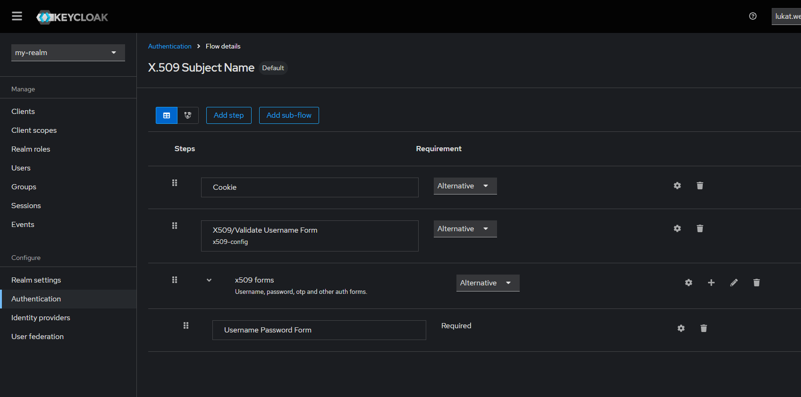

4. Configure the "x509 Validate Username Form" as follows:

| Key                        | Value                 |
| -------------------------- | --------------------- |
| User Identity Source       | Subject's Common Name |
| User mapping method        | Username or Email     |
| Check certificate validity | On                    |

5. Bind the flow to the "Browser flow".

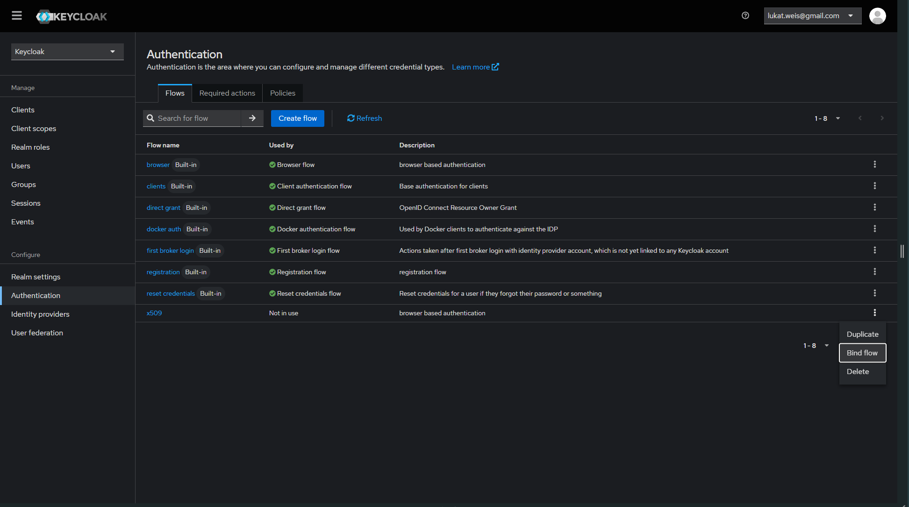

Configure URLs accordingly to your domain and proxy settings (https://myinstance.mydomain.de). Optionally add localhost to support a local development environment.

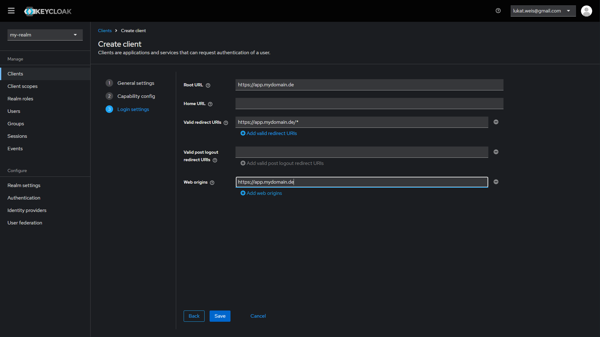

#### Add a new user attribute "registrationNumber" to the realm
The attribute is used to assign a (tablet) user to a bus. Go to `admin/master/console/#/my-realm/realm-settings/user-profile` to add a new Attribute "registrationNumber". Make sure "User" can view the attribute and annotate it as "inputType": "text".

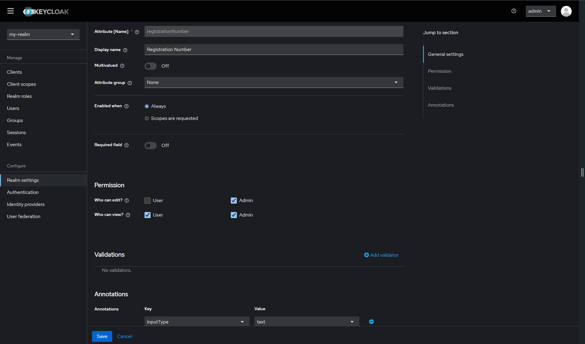

Since the frontend and backend need to validate user permissions based on the role and registrationNumber, we need to include the attribute into the access token.

In your new realm, select `Client scopes` -> `profile` -> `Mappers` -> `Add mapper` -> `By configuration` -> `User attribute`.

Add "registrationNumber" as shown below:

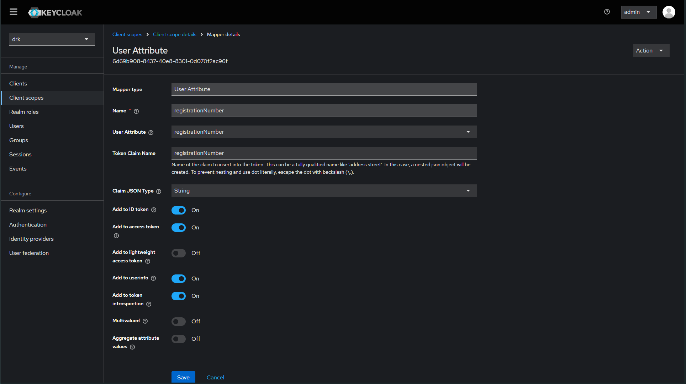

#### Set Theme
Configure the realm to use the Kaeltebus Theme by selecting "kaeltebus" in `admin/master/console/#/my-realm/realm-settings/themes` as the "Login theme".

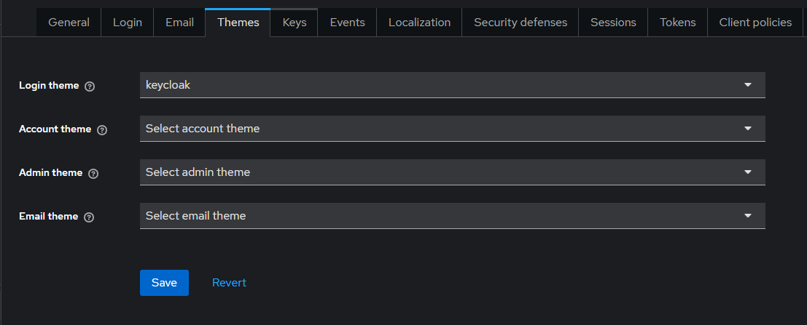

#### Create a new client for user authentication
In the new realm, create a new client for your kaeltebus instance. Make sure to check "Standard flow" and "Direct access grants".

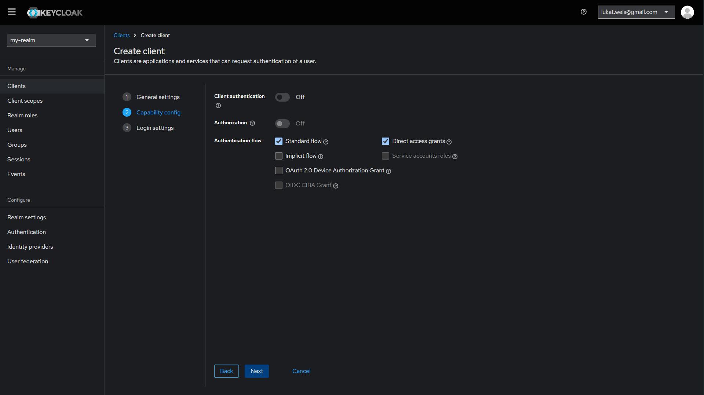

In the newly ceated client, create the Roles "ADMIN" and "OPERATOR".
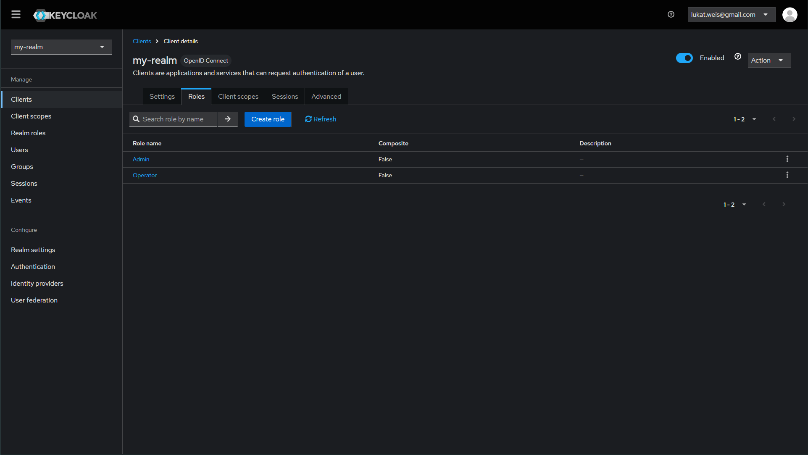

To make sure that roles are included in the token and profile, select `Client Scopes` -> `Mappers` -> `client roles`. Check each switch to include the roles in all tokens and userinfo.

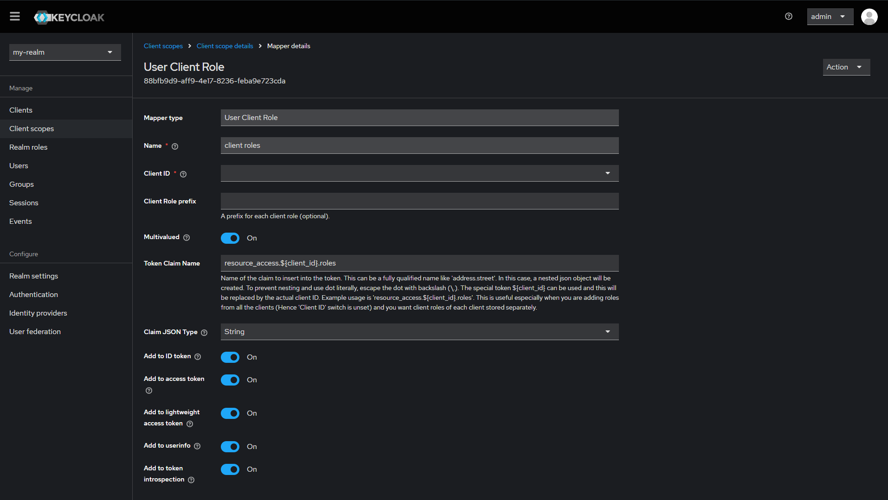

#### Create a new client for machine authentication
The client is used by the backend to manage users. When creating the client, make sure to check "Client authentication" and to only select "Service account roles".
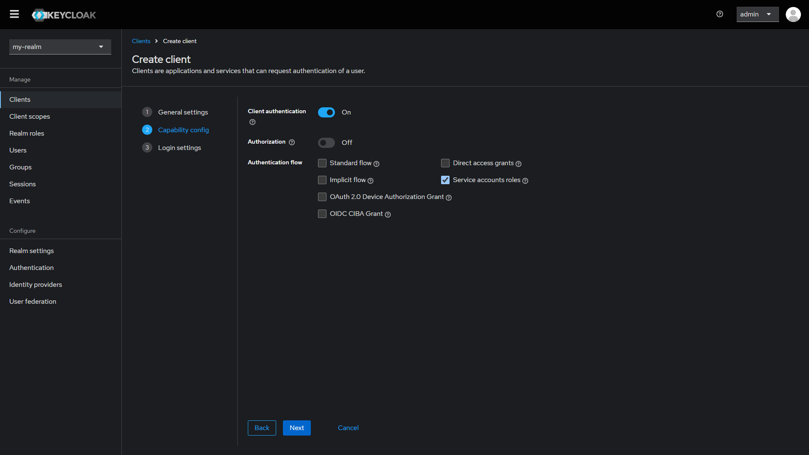

Grant the newly created client required permissions "view-users", "view-realm", "view-clients", "query-users", "query-groups", "query-clients" and "manage-users".
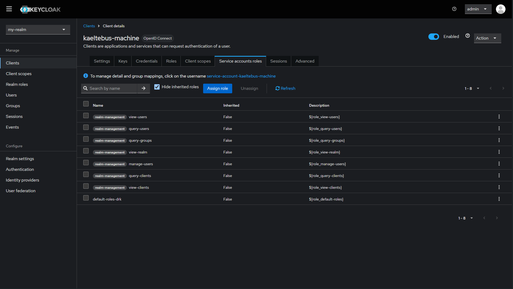


#### Add initial user

Add an initial admin User in "Users". Assign the "ADMIN" Role in "Role mapping" and create a Password in "Credentials".
