# Deploy

## Prerequisites

> [!TIP]
> For preparing a fresh VPS (user setup, SSH hardening, firewall, Docker), see the [VPS setup guide](./vps.md).

This guide assumes a `kaeltehilfe` user with Docker access has been set up as described in the [VPS setup guide](./vps.md). All commands are run as this user.

### DNS
Configure DNS A records pointing to the Docker host. This guide uses the following domains as examples:

| Domain | Service |
| ------ | ------- |
| `proxy.mydomain.de` | NGINX Proxy Manager |
| `auth.mydomain.de` | Keycloak |
| `myinstance.mydomain.de` | kaeltehilfe (frontend + backend API) |

### Docker
The host must have Docker (or a compose-compatible container service) installed and running.


## Prepare the host

### Directory structure

All images must have been built according to the [build documentation](./build.md).

### OSM data

> [!NOTE]
> There is a bug with hash checking when pgosm-init downloads `.pbf` files automatically. To avoid this, download and place the file manually as described below.

Download an `.osm.pbf` file from [Geofabrik](https://download.geofabrik.de/) and place it in `./build/result/pgosm-init/input/`.

Adjust the configuration for the `pgosm-init` service in the `docker-compose.yml` to work with the downloaded file through `PGOSM_REGION`, `PGOSM_SUBREGION`, and `PGOSM_INPUT_FILE`. See the [pgosm-flex documentation](https://pgosm-flex.com/common-customization.html) for details on available regions.


### Copy files to the host

Copy the `build/result` directory to the Docker host.

**Windows (WinSCP):**
Connect to the host as `kaeltehilfe` using your `.ppk` key. Drag the `build\result` folder to `/home/kaeltehilfe/`.

**Linux/macOS:**
```bash
rsync -av build/result/ kaeltehilfe@<your-ip>:/home/kaeltehilfe/
```

Remove `.gitignore` files (not needed on the server) and create any missing directories so the final structure matches:

```
/home/kaeltehilfe
├── certs
│   ├── crl/                            (shared between api and keycloak)
│   ├── root-crt/                       (generated by certs-init)
│   └── root-pfx/                       (generated by certs-init)
├── docker
│   ├── .env
│   ├── docker-compose.yml
│   └── images
│       ├── kaeltehilfe-api.tar
│       ├── kaeltehilfe-certs-init.tar
│       ├── kaeltehilfe-geo.tar
│       ├── kaeltehilfe-keycloak.tar
│       ├── kaeltehilfe-keycloak-init.tar
│       ├── kaeltehilfe-ui.tar
│       └── pgosm-init.tar
├── kaeltehilfe-api
│   ├── config
│   │   └── appsettings.json
│   ├── cert
│   │   └── client/
│   └── db/
├── keycloak
│   ├── data/
│   └── themes
│       └── kaeltehilfe-keycloak-theme.jar
├── nginx
│   ├── data/
│   └── letsencrypt/
├── pgosm-db
│   └── postgresql/
└── pgosm-init
    └── input/                          (.osm.pbf files)
```

The `certs/root-crt/` and `certs/root-pfx/` directories are populated automatically by the `certs-init` container on first start.

> [!IMPORTANT]
> Containers need read/write access to their data directories. Set ownership and permissions:
> ```bash
> sudo chown -R kaeltehilfe:kaeltehilfe /home/kaeltehilfe
> sudo chmod -R 755 /home/kaeltehilfe
> ```

> [!WARNING]
> WinSCP does not show hidden files (`.env`, `.gitignore`) by default. The `.gitignore` files can be removed from the host.

### Load Docker images

Load all exported images on the host:
```bash
for tar in /home/kaeltehilfe/docker/images/*.tar; do
    docker load -i "$tar"
done
```

### Configuration

Fill in `.env` and `appsettings.json` as described in the [build documentation](./build.md#configuration).

The frontend configuration (API URLs, Keycloak authority) is injected at container startup from environment variables defined in docker-compose. No build-time URL configuration is needed.


## Initial deployment

On the first deployment, the NGINX Proxy Manager must be configured before the other services can start. All other services (certificates, Keycloak realm, database) are configured automatically by their init containers.

### 1. Start proxy only

```bash
cd /home/kaeltehilfe/docker
docker compose up proxy -d
```

### 2. Configure NGINX Proxy Manager

Connect to NGINX Proxy Manager via SSH tunnel (see [VPS setup — Firewall](./vps.md#3-firewall)) and log in using the default credentials:

| | |
| -------- | ----------------- |
| Email | `admin@example.com` |
| Password | `changeme` |

Update the default credentials immediately.

Configure proxy hosts for the following domains and issue Let's Encrypt certificates for each. Check **Block Common Exploits** in the Details tab and **Force SSL** + **HTTP/2 Support** in the SSL tab.

| Domain | Target | Custom locations | Description |
| ------ | ------ | ---------------- | ----------- |
| `proxy.mydomain.de` | `http://127.0.0.1:81` | `/` => `http://127.0.0.1:81` | Route to NGINX Proxy Manager itself |
| `auth.mydomain.de` | `http://127.0.0.1:8080` | `/` => `http://127.0.0.1:8080` | Route to Keycloak |
| `myinstance.mydomain.de` | `http://127.0.0.1:8082` | `/` => `http://127.0.0.1:8082`<br>`/api` => `http://127.0.0.1:8081`<br>`/geo` => `http://127.0.0.1:8083`<br>`/admin` => `http://127.0.0.1:8082` | Routes to frontend, backend, and geo |

> [!WARNING]
> If enabling SSL results in an internal server error, you might have to connect through your external domain through port 80 (http://proxy.mydomain.de) first and enable SSL in a second step by editing the proxs hosts.


#### Keycloak proxy headers

Add the following to the **Custom Nginx Configuration** of the `/` location in `auth.mydomain.de`:
```
proxy_set_header X-Forwarded-For $proxy_protocol_addr;
proxy_set_header X-Forwarded-Proto $scheme;
proxy_set_header X-Forwarded-Host $host;
proxy_set_header X-Forwarded-Port 443;

proxy_set_header X-Client-Cert $ssl_client_escaped_cert;
```
The first four headers ensure correct forwarding behind the proxy. The last line forwards client certificates in the `X-Client-Cert` header so that Keycloak can verify them for X.509 authentication.

Add the following to the **Advanced** tab of the Keycloak proxy host:
```
proxy_buffer_size   128k;
proxy_buffers   4 256k;
proxy_busy_buffers_size   256k;

ssl_verify_client optional_no_ca;
```
The first three lines are buffer size adjustments required by Keycloak. The last line makes NGINX accept client certificates without validating them (Keycloak handles validation).

### 3. Start all services

```bash
cd /home/kaeltehilfe/docker
docker compose up -d
```

> [!NOTE]
> If your vps has a little memory, you might want to start api, geo and ui in a second step, after pgosm-init completed and memory is freed up again.


The init containers (`certs-init`, `keycloak-init`, `pgosm-init`) run once and exit after completing. On subsequent starts they detect existing resources and skip setup.


## Updating

To update a service, rebuild its image (see [build.md](./build.md)), copy the new `.tar` to the host, load it, and restart:

```bash
docker load -i /home/kaeltehilfe/docker/images/<image>.tar
cd /home/kaeltehilfe/docker
docker compose up -d <service>
```

To update the backend configuration, edit `kaeltehilfe-api/config/appsettings.json` and restart the `api` service:
```bash
docker compose restart api
```


## Keycloak configuration reference

The `keycloak-init` container automatically creates all Keycloak resources described below. This section serves as a reference for what is configured and as a guide for manual adjustments.

<details>
<summary>Keycloak setup details</summary>

### Create a new realm
On the top left corner select "Create realm" and create a realm for the application (e.g. "kaeltehilfe").

Under `admin/master/console/#/kaeltehilfe/realm-settings`, configure "Require SSL" to "All requests".

### Configure a login flow to support password and client cert login
1. Under `/admin/master/console/#/kaeltehilfe/authentication`, copy the "browser" flow as "x509".
2. Remove all steps but "Cookie" and "x509 forms". In "x509 forms", delete all options but "Username Password Form".
3. Add "x509 Validate Username Form" as a top level step, move it as the second entry and set "Requirement" to "Alternative".

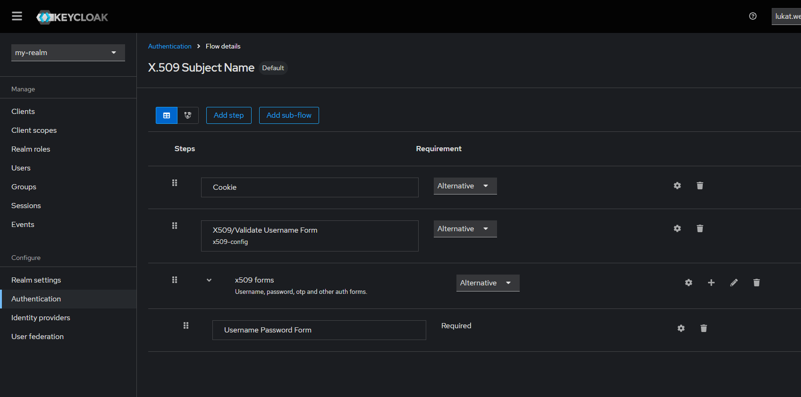

4. Configure the "x509 Validate Username Form" as follows:

| Key                        | Value                 |
| -------------------------- | --------------------- |
| User Identity Source       | Subject's Common Name |
| User mapping method        | Username or Email     |
| Check certificate validity | On                    |

5. Bind the flow to the "Browser flow".

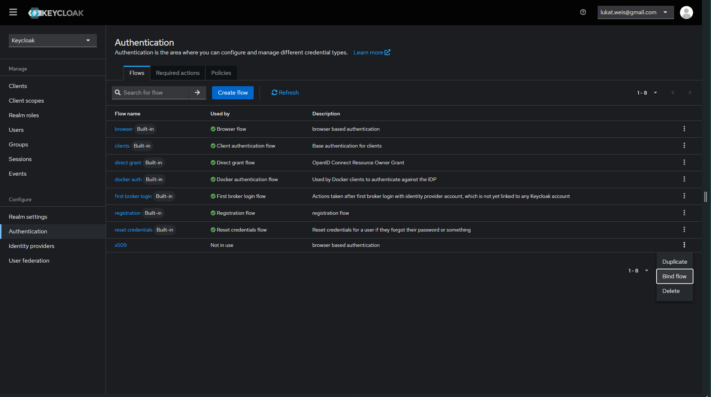

### Add a new user attribute "registrationNumber" to the realm
The attribute is used to assign a (tablet) user to a bus. Go to `admin/master/console/#/kaeltehilfe/realm-settings/user-profile` to add a new Attribute "registrationNumber". Make sure "User" can view the attribute and annotate it as "inputType": "text".

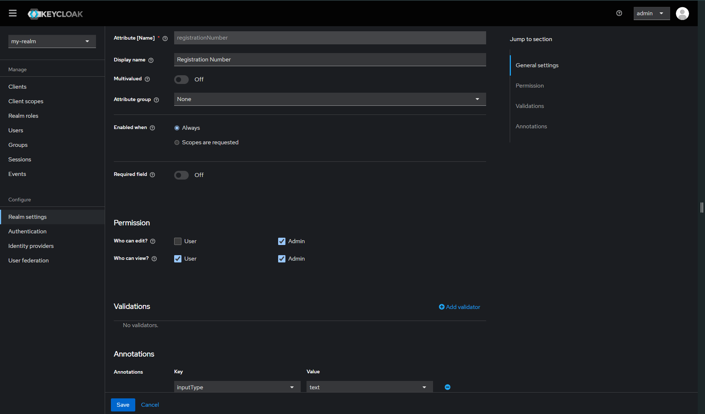

Since the frontend and backend need to validate user permissions based on the role and registrationNumber, we need to include the attribute into the access token.

In your new realm, select `Client scopes` -> `profile` -> `Mappers` -> `Add mapper` -> `By configuration` -> `User attribute`.

Add "registrationNumber" as shown below:

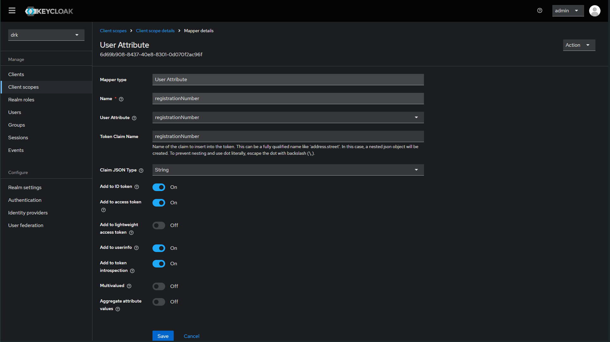

### Set Theme
Configure the realm to use the kaeltehilfe Theme by selecting "kaeltehilfe" in `admin/master/console/#/kaeltehilfe/realm-settings/themes` as the "Login theme".

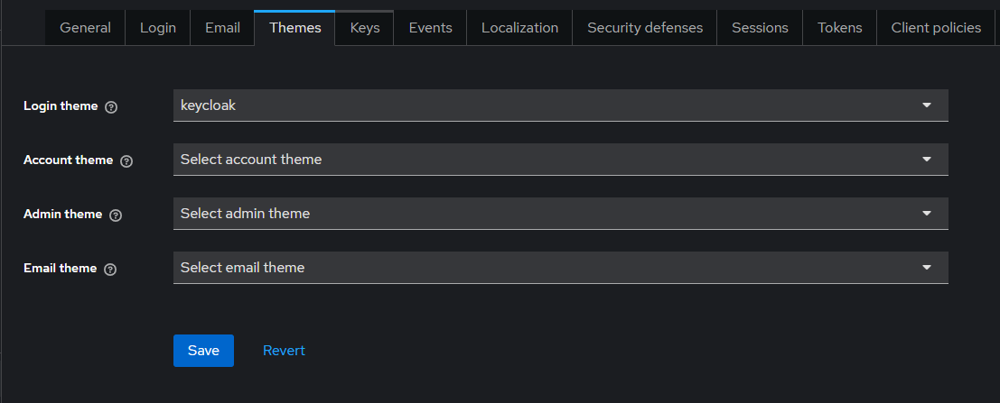

### Create a new client for user authentication
In the new realm, create a new client for your kaeltehilfe instance. Make sure to check "Standard flow" and "Direct access grants".

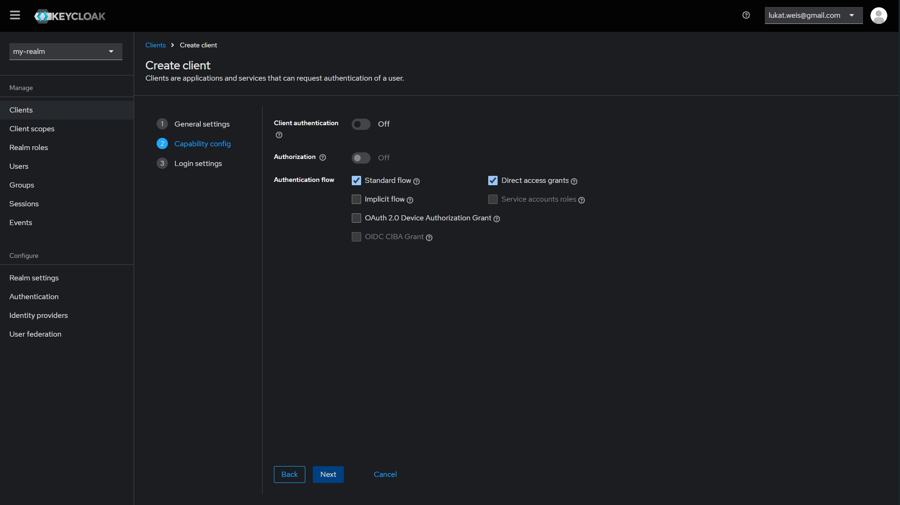

Configure URLs accordingly to your domain and proxy settings (e.g. `https://myinstance.mydomain.de`). Optionally add localhost to support a local development environment.

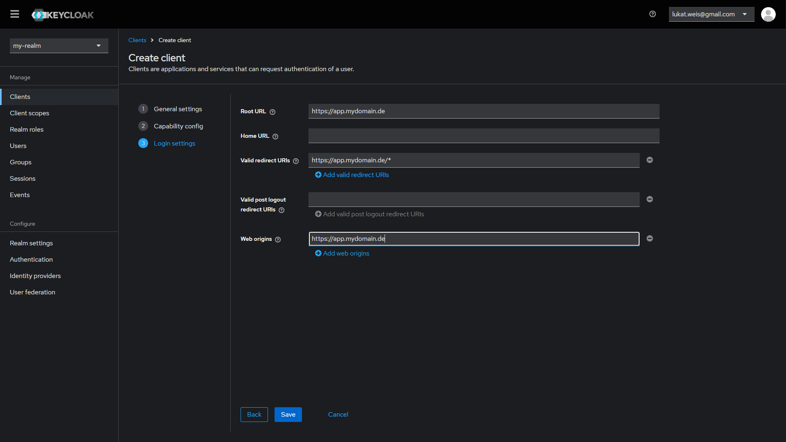

In the newly created client, create the Roles "ADMIN" and "OPERATOR".

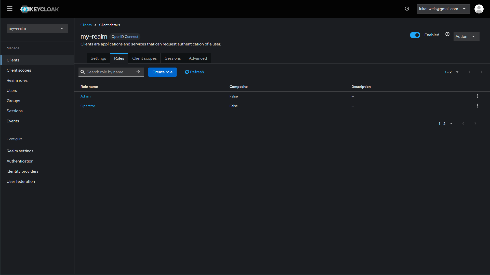

To make sure that roles are included in the token and profile, select `Client Scopes` -> `roles` -> `Mappers` -> `client roles`. Check each switch to include the roles in all tokens and userinfo.

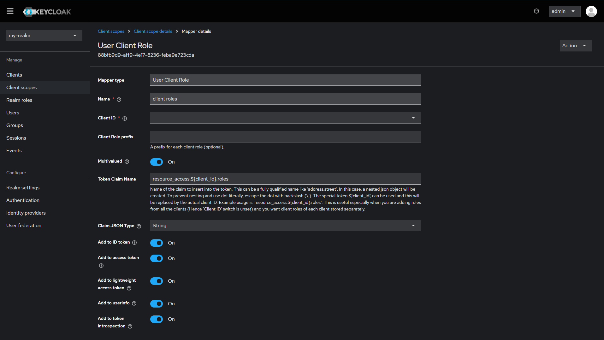

### Create a new client for machine authentication
The client is used by the backend to manage users. When creating the client, make sure to check "Client authentication" and to only select "Service account roles".

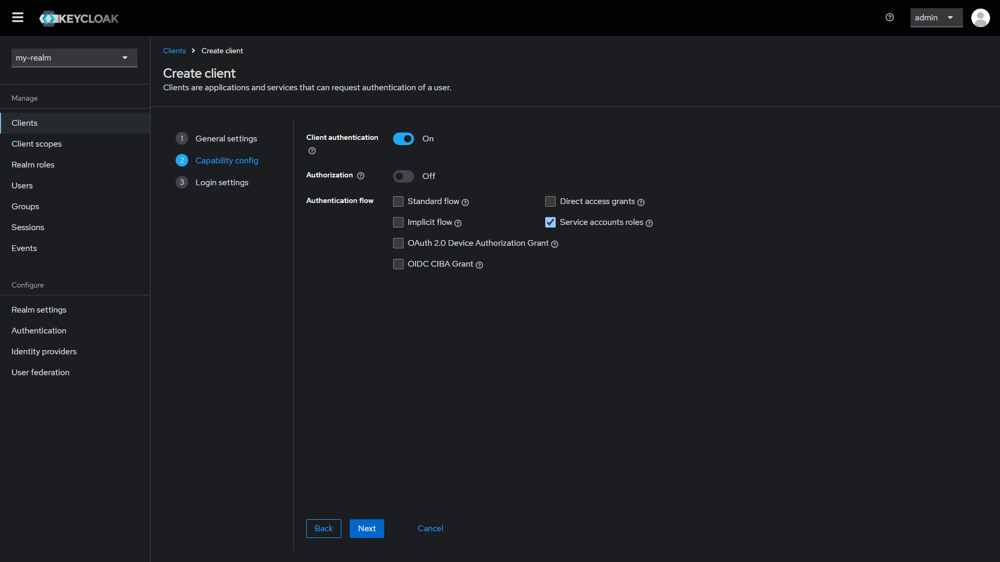

Grant the newly created client required permissions "view-users", "view-realm", "view-clients", "query-users", "query-groups", "query-clients" and "manage-users".

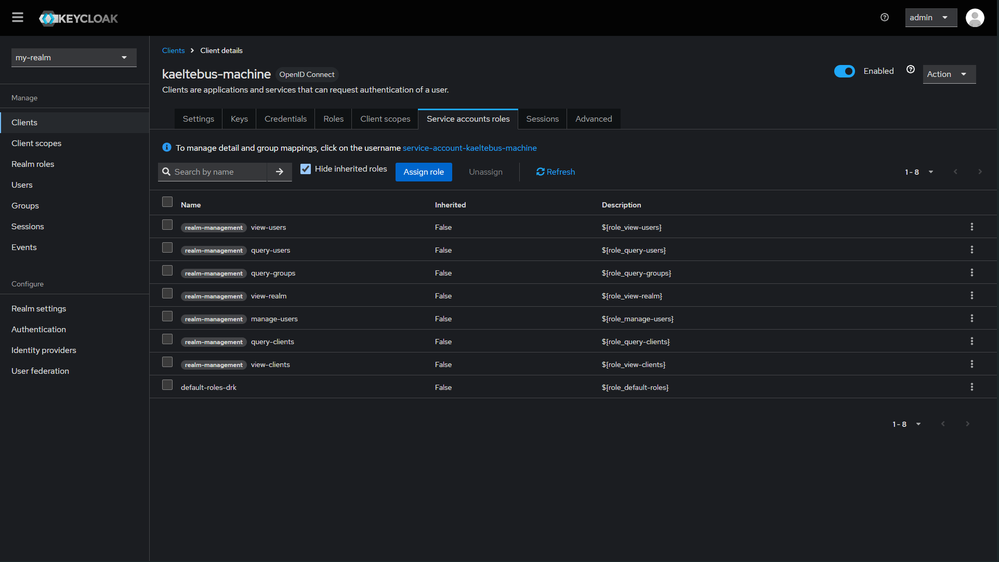

### Add initial user

Add an initial admin User in "Users". Assign the "ADMIN" Role in "Role mapping" and create a Password in "Credentials".

</details>
